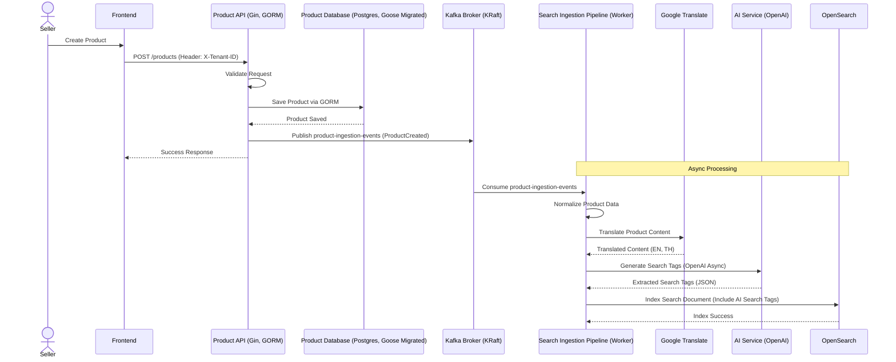
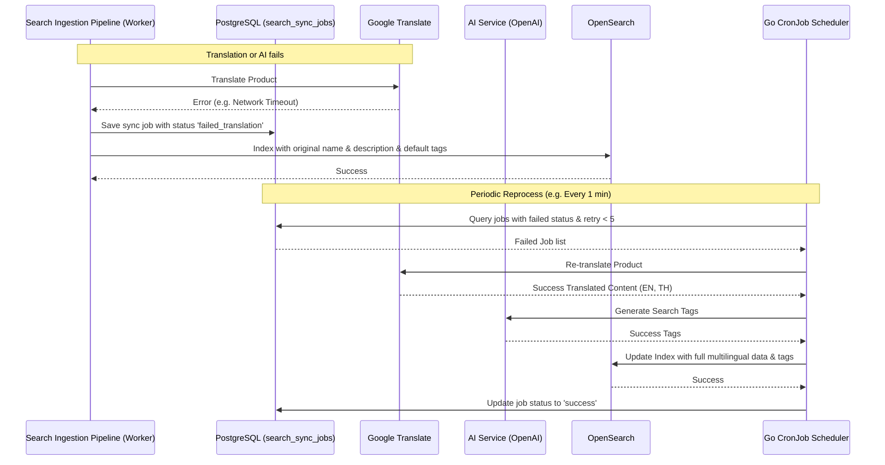
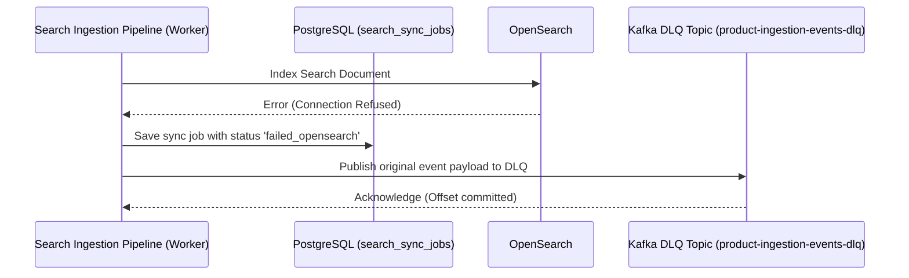

# US-001 - Product Ingestion

Status: Draft

Priority: High

Related Requirements:

* FR-005 Multilingual Search
* FR-004 Synonym Expansion
* FR-001 Product Search

---

# 1. Tiếng Việt

## Mục tiêu

Cho phép người bán tạo mới hoặc cập nhật sản phẩm và tự động chuẩn bị toàn bộ dữ liệu phục vụ cho hệ thống tìm kiếm.

Hệ thống phải đảm bảo sản phẩm sau khi được tạo có thể được tìm kiếm bằng nhiều ngôn ngữ khác nhau và sẵn sàng tham gia vào quá trình ranking, autocomplete, spellcheck và synonym expansion.

## User Story

Là một Seller,

Tôi muốn tạo hoặc cập nhật sản phẩm,

Để sản phẩm của tôi có thể được người mua tìm thấy thông qua hệ thống tìm kiếm.

## Actor

* Seller

## Điều kiện tiên quyết

* Seller đã đăng nhập hệ thống.
* Seller có quyền tạo hoặc chỉnh sửa sản phẩm.
* Hệ thống Search Engine đang hoạt động.
* Google Translate Service khả dụng.

## Luồng chính

1. Seller nhập thông tin sản phẩm.
2. Seller nhấn nút tạo sản phẩm.
3. Hệ thống kiểm tra tính hợp lệ của dữ liệu.
4. Hệ thống lưu sản phẩm vào Product Database.
5. Hệ thống gửi dữ liệu sản phẩm sang Search Ingestion Pipeline.
6. Search Ingestion Pipeline thực hiện:

    * Chuẩn hóa dữ liệu.
    * Dịch tiêu đề và mô tả sang các ngôn ngữ được hỗ trợ.
    * Tách từ (tokenization).
    * Sinh keyword tìm kiếm.
7. Hệ thống tạo Search Document.
8. Hệ thống index Search Document vào OpenSearch.
9. Hệ thống trả về kết quả thành công.

## Luồng thay thế
 
### AF-01 - Dịch thuật & AI sinh tag lỗi (Google Translate / OpenAI lỗi)

1. Sản phẩm vẫn được lưu thành công vào Product Database.
2. Ingestion Pipeline ghi nhận lỗi, lưu trạng thái tương ứng (`failed_translation` hoặc `failed_ai`) cùng thông điệp lỗi chi tiết vào bảng `search_sync_jobs`.
3. Ingestion Pipeline vẫn tiếp tục thực hiện index sản phẩm lên OpenSearch bằng ngôn ngữ gốc và tag mặc định (`["sảnphẩm", "amaze"]`) để người dùng tìm thấy sản phẩm ngay lập tức.
4. Một trình lập lịch cronjob tích hợp trong mã nguồn (CronJob Reprocessor) sẽ chạy định kỳ để tự động quét bảng `search_sync_jobs`, thực hiện dịch thuật/AI lại và cập nhật index OpenSearch (tối đa 5 lần thử).

### AF-02 - OpenSearch không khả dụng

1. Sản phẩm vẫn được lưu thành công vào Product Database.
2. Ingestion Pipeline ghi nhận lỗi, cập nhật trạng thái `failed_opensearch` vào bảng `search_sync_jobs`.
3. Ingestion Pipeline đẩy sự kiện gốc vào Kafka Dead Letter Queue (DLQ) topic `product-ingestion-events-dlq` để bảo toàn dữ liệu, tránh block consumer và tiếp tục tiêu thụ tin nhắn tiếp theo.

### AF-03 - Dữ liệu không hợp lệ

1. Hệ thống từ chối tạo sản phẩm.
2. Hệ thống trả về thông báo lỗi tương ứng.

## Sequence Diagram

### Product Creation & Search Indexing Flow

### Translation & AI Generation Failure Flow

### OpenSearch Failure Flow

## Business Data Transformation

| Stage                   | Input                      | Output                        |
| ----------------------- | -------------------------- | ----------------------------- |
| Product Creation        | Cà phê Robusta nguyên chất | Product Record (GORM)         |
| Translation             | Cà phê Robusta nguyên chất | Pure Robusta Coffee (EN, TH)  |
| AI Search Tag Gen       | Product Data               | ["cà phê phin", "cà phê đen"] |
| OpenSearch Indexing     | Search Document Payload    | Indexed Document              |

## Tiêu chí chấp nhận

### AC-001

Given Seller nhập thông tin hợp lệ và có truyền Header `X-Tenant-ID`

When tạo sản phẩm

Then sản phẩm được lưu thành công vào PostgreSQL thông qua GORM

### AC-002

Given sản phẩm được tạo thành công

When Search Ingestion Pipeline tiêu thụ event từ Kafka hoàn thành

Then sản phẩm xuất hiện trong Search Index

### AC-003

Given sản phẩm chỉ được nhập bằng tiếng Việt

When quá trình dịch hoàn tất

Then hệ thống sinh dữ liệu tìm kiếm cho tiếng Anh và tiếng Thái

### AC-004

Given OpenSearch tạm thời không khả dụng

When Seller tạo sản phẩm

Then sản phẩm vẫn được lưu thành công vào database và Worker ghi nhận trạng thái `failed_opensearch` đồng thời đẩy sự kiện gốc vào Kafka DLQ `product-ingestion-events-dlq` để bảo toàn dữ liệu

### AC-005

Given sản phẩm được tạo thành công và đi vào Ingestion Pipeline

When quá trình xử lý băm văn bản cho thấy nội dung văn bản bị thay đổi

Then hệ thống gọi AI Service để sinh ra danh sách `search_tags` tự động và lưu vào Search Document

### AC-006

Given dịch thuật hoặc AI sinh tag tạm thời bị lỗi

When Seller tạo sản phẩm

Then sản phẩm vẫn được index lên OpenSearch bằng ngôn ngữ gốc, Worker ghi nhận trạng thái lỗi (`failed_translation` / `failed_ai`) và tự động được đồng bộ lại hoàn chỉnh bởi Go CronJob chạy ngầm khi các dịch vụ hoạt động bình thường trở lại

## Business Rules

### BR-001

Product Database là Source of Truth. Cơ sở dữ liệu được quản lý cấu trúc bằng Goose migrations.

### BR-002

OpenSearch chỉ lưu dữ liệu phục vụ tìm kiếm.

### BR-003

Translation và AI Search Tag Generation không được block luồng tạo sản phẩm của Seller. Luồng này chạy hoàn toàn bất đồng bộ thông qua event stream trên Kafka.

### BR-004

Mọi thay đổi sản phẩm (tạo, cập nhật, xóa) đều phải publish event tương ứng lên Kafka để trigger re-index.

### BR-005

Hệ thống phải hỗ trợ mở rộng thêm ngôn ngữ trong tương lai.

## Dữ liệu đầu vào

*   `X-Tenant-ID` (Header)
*   Product Name
*   Product Description
*   Category ID
*   Brand
*   Price
*   Image URL
*   Inventory
*   Status

## Kết quả đầu ra

*   Product được lưu trong PostgreSQL bằng GORM.
*   Sự kiện `ProductCreated` hoặc `ProductUpdated` được publish lên Kafka topic `product-ingestion-events`.
*   Search Document được index vào OpenSearch.

## Độ ưu tiên

High

## Ghi chú

Đây là User Story nền tảng của toàn bộ hệ thống.

Tất cả các User Story liên quan đến Search, Translation, Synonym, Ranking và AI đều phụ thuộc vào dữ liệu được tạo từ User Story này.

---

# 2. English Version

(To be maintained equivalent to the Vietnamese section above)
