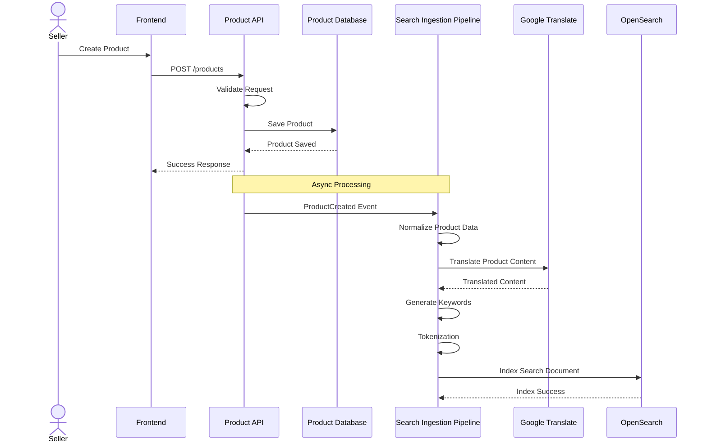
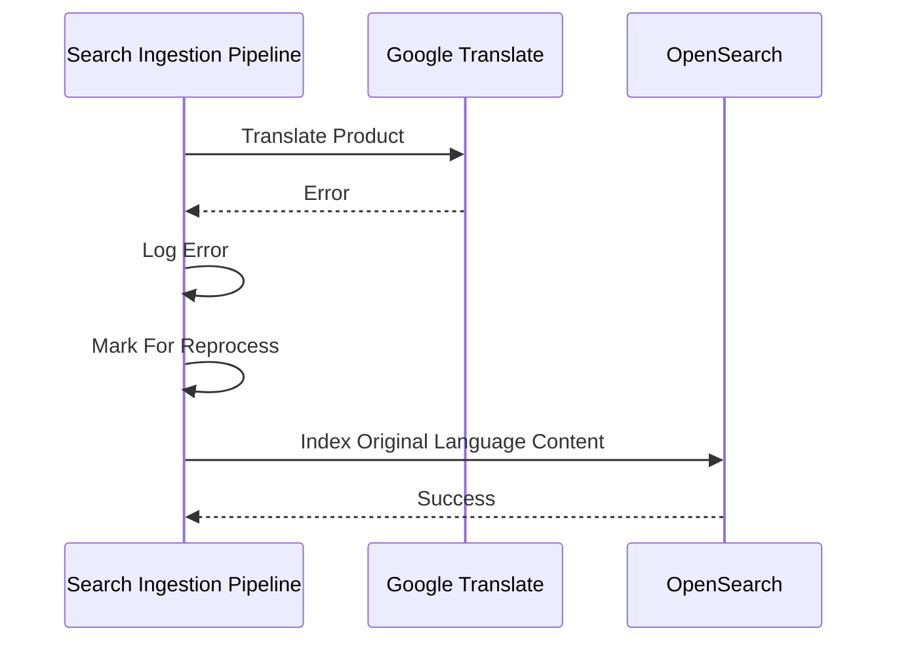
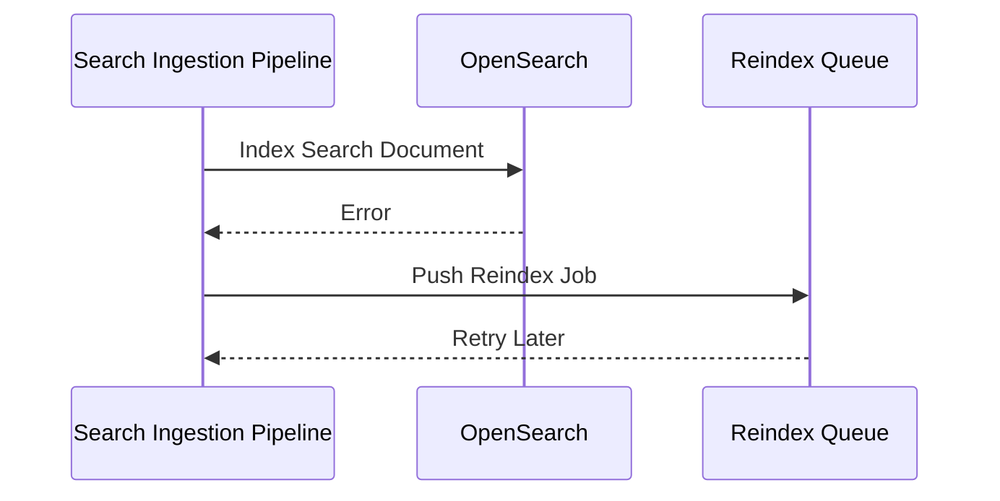

# US-001 - Product Ingestion

Status: Draft

Priority: High

Related Requirements:

* FR-005 Multilingual Search
* FR-004 Synonym Expansion
* FR-001 Product Search

---

# 1. Tiếng Việt

## Mục tiêu

Cho phép người bán tạo mới hoặc cập nhật sản phẩm và tự động chuẩn bị toàn bộ dữ liệu phục vụ cho hệ thống tìm kiếm.

Hệ thống phải đảm bảo sản phẩm sau khi được tạo có thể được tìm kiếm bằng nhiều ngôn ngữ khác nhau và sẵn sàng tham gia vào quá trình ranking, autocomplete, spellcheck và synonym expansion.

## User Story

Là một Seller,

Tôi muốn tạo hoặc cập nhật sản phẩm,

Để sản phẩm của tôi có thể được người mua tìm thấy thông qua hệ thống tìm kiếm.

## Actor

* Seller

## Điều kiện tiên quyết

* Seller đã đăng nhập hệ thống.
* Seller có quyền tạo hoặc chỉnh sửa sản phẩm.
* Hệ thống Search Engine đang hoạt động.
* Google Translate Service khả dụng.

## Luồng chính

1. Seller nhập thông tin sản phẩm.
2. Seller nhấn nút tạo sản phẩm.
3. Hệ thống kiểm tra tính hợp lệ của dữ liệu.
4. Hệ thống lưu sản phẩm vào Product Database.
5. Hệ thống gửi dữ liệu sản phẩm sang Search Ingestion Pipeline.
6. Search Ingestion Pipeline thực hiện:

    * Chuẩn hóa dữ liệu.
    * Dịch tiêu đề và mô tả sang các ngôn ngữ được hỗ trợ.
    * Tách từ (tokenization).
    * Sinh keyword tìm kiếm.
7. Hệ thống tạo Search Document.
8. Hệ thống index Search Document vào OpenSearch.
9. Hệ thống trả về kết quả thành công.

## Luồng thay thế

### AF-01 - Google Translate lỗi

1. Sản phẩm vẫn được lưu thành công.
2. Hệ thống ghi log lỗi.
3. Hệ thống đánh dấu sản phẩm cần re-process.
4. Hệ thống tiếp tục index bằng ngôn ngữ gốc.

### AF-02 - OpenSearch không khả dụng

1. Sản phẩm vẫn được lưu vào Product Database.
2. Hệ thống đưa sản phẩm vào Reindex Queue.
3. Hệ thống thực hiện index lại khi OpenSearch hoạt động trở lại.

### AF-03 - Dữ liệu không hợp lệ

1. Hệ thống từ chối tạo sản phẩm.
2. Hệ thống trả về thông báo lỗi tương ứng.

## Sequence Diagram

### Product Creation & Search Indexing Flow

### Translation Failure Flow

### OpenSearch Failure Flow

## Business Data Transformation

| Stage              | Input                      | Output                |
| ------------------ | -------------------------- | --------------------- |
| Product Creation   | Cà phê Robusta nguyên chất | Product Record        |
| Translation        | Cà phê Robusta nguyên chất | Pure Robusta Coffee   |
| Keyword Generation | Product Data               | coffee, robusta, cafe |
| Tokenization       | coffee robusta             | [coffee, robusta]     |
| Indexing           | Search Document            | OpenSearch Document   |

## Tiêu chí chấp nhận

### AC-001

Given Seller nhập thông tin hợp lệ

When tạo sản phẩm

Then sản phẩm được lưu thành công

### AC-002

Given sản phẩm được tạo thành công

When Search Ingestion Pipeline hoàn thành

Then sản phẩm xuất hiện trong Search Index

### AC-003

Given sản phẩm chỉ được nhập bằng tiếng Việt

When quá trình dịch hoàn tất

Then hệ thống sinh dữ liệu tìm kiếm cho tiếng Anh và tiếng Thái

### AC-004

Given OpenSearch tạm thời không khả dụng

When Seller tạo sản phẩm

Then sản phẩm vẫn được lưu thành công

## Business Rules

### BR-001

Product Database là Source of Truth.

### BR-002

OpenSearch chỉ lưu dữ liệu phục vụ tìm kiếm.

### BR-003

Translation không được block luồng tạo sản phẩm.

### BR-004

Mọi thay đổi sản phẩm đều phải trigger re-index.

### BR-005

Hệ thống phải hỗ trợ mở rộng thêm ngôn ngữ trong tương lai.

## Dữ liệu đầu vào

* Product Name
* Product Description
* Category
* Brand
* Inventory
* Status

## Kết quả đầu ra

* Product được lưu trong Product Database.
* Search Document được tạo.
* Search Document được index vào OpenSearch.

## Độ ưu tiên

High

## Ghi chú

Đây là User Story nền tảng của toàn bộ hệ thống.

Tất cả các User Story liên quan đến Search, Translation, Synonym, Ranking và AI đều phụ thuộc vào dữ liệu được tạo từ User Story này.

---

# 2. English Version

(To be maintained equivalent to the Vietnamese section above)
