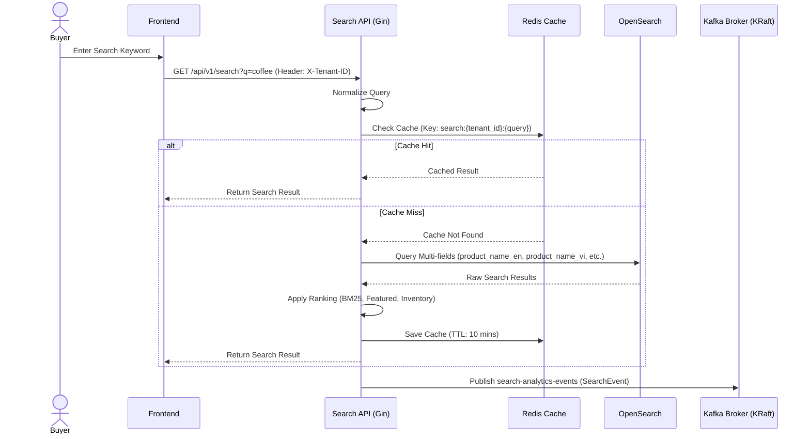
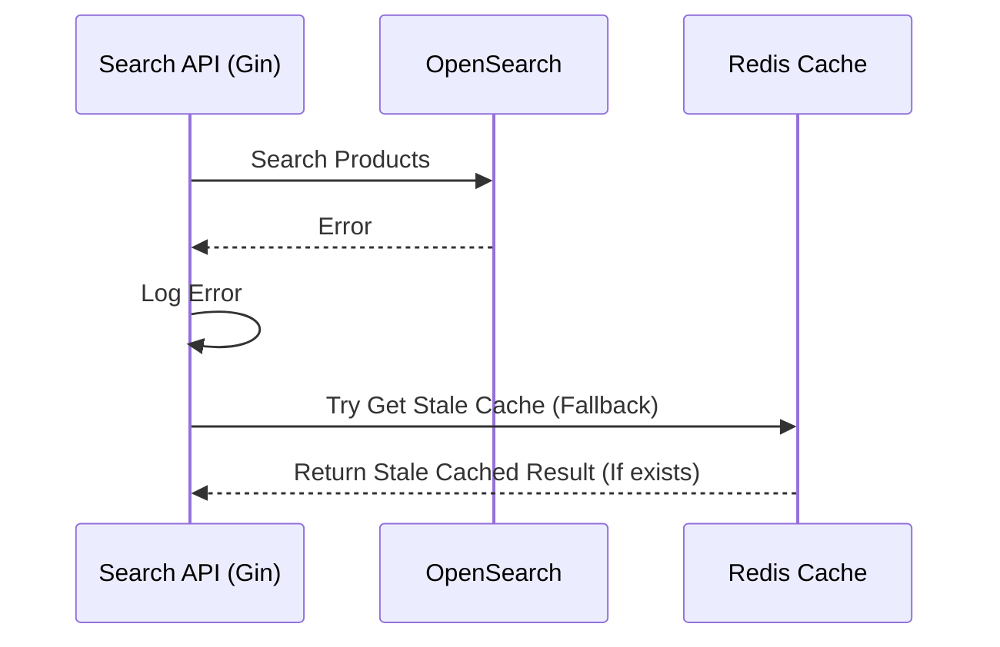

# US-002 - Product Search

Status: Draft

Priority: High

Related Requirements:

* FR-001 Product Search
* FR-004 Synonym Expansion
* FR-005 Multilingual Search
* FR-007 Ranking Engine

---

# 1. Tiếng Việt

## Mục tiêu

Cho phép người mua tìm kiếm sản phẩm bằng từ khóa và nhận được danh sách sản phẩm phù hợp nhất.

Hệ thống phải hỗ trợ tìm kiếm nhanh, chính xác và có khả năng mở rộng để tích hợp Spellcheck, Synonym Expansion, Multilingual Search và Ranking Engine.

## User Story

Là một Customer,

Tôi muốn tìm kiếm sản phẩm bằng từ khóa,

Để nhanh chóng tìm được sản phẩm phù hợp với nhu cầu của mình.

## Actor

* Customer

## Điều kiện tiên quyết

* Sản phẩm đã được index vào OpenSearch.
* Hệ thống Search Engine đang hoạt động.
* Redis Cache khả dụng.
* Customer có quyền truy cập chức năng tìm kiếm.

## Luồng chính

1. Customer nhập từ khóa tìm kiếm.

2. Frontend gửi request tới Search API.

3. Search API chuẩn hóa từ khóa tìm kiếm.

    * Chuyển về chữ thường.
    * Loại bỏ khoảng trắng dư thừa.
    * Chuẩn hóa ký tự đặc biệt.

4. Search API kiểm tra Redis Cache.

5. Nếu kết quả đã tồn tại trong Cache:

    * Trả về kết quả từ Cache.

6. Nếu không tồn tại trong Cache:

    * Thực hiện truy vấn OpenSearch.

7. OpenSearch trả về danh sách sản phẩm phù hợp.

8. Search API thực hiện ranking kết quả.

9. Hệ thống lưu kết quả vào Redis Cache.

10. Hệ thống ghi nhận Search Analytics.

11. Hệ thống trả kết quả cho Customer.

## Luồng thay thế

### AF-01 - Cache Hit

1. Redis trả về kết quả tìm kiếm.
2. Hệ thống không truy vấn OpenSearch.
3. Kết quả được trả về ngay cho Customer.

### AF-02 - Không tìm thấy sản phẩm

1. OpenSearch không trả về kết quả.
2. Hệ thống trả về danh sách rỗng.
3. Search Event vẫn được ghi nhận.

### AF-03 - OpenSearch không khả dụng

1. Hệ thống ghi log lỗi.
2. Hệ thống trả về lỗi Search Service Unavailable.
3. Customer nhận được thông báo phù hợp.

### AF-04 - Query không hợp lệ

1. Query vượt quá giới hạn cho phép.
2. Hệ thống từ chối xử lý.
3. Trả về Validation Error.

## Sequence Diagram

### Product Search Flow

### OpenSearch Failure Flow

## Search Scope

Hệ thống hỗ trợ tìm kiếm trên các trường được lập chỉ mục trong OpenSearch:

*   `product_name_vi`
*   `product_name_en`
*   `product_name_th`
*   `description_vi`
*   `brand`
*   `search_tags` (AI-generated)

## Ranking Priority

Kết quả tìm kiếm được sắp xếp theo thứ tự ưu tiên:

1.  Exact Match (Trùng khớp tuyệt đối trên name)
2.  Phrase Match (Trùng khớp cụm từ)
3.  Synonym Match (Mở rộng đồng nghĩa ở search-time)
4.  Translation Match (Mở rộng dịch thuật)
5.  Featured Boost (Tăng hạng sản phẩm nổi bật)
6.  Inventory Decay (Giảm hạng sản phẩm hết hàng)

Chi tiết thuật toán Ranking sẽ được mô tả tại US-007 Ranking Engine.

## Search Data Flow

| Stage         | Input           | Output          |
| ------------- | --------------- | --------------- |
| Query Input   | coffee          | coffee          |
| Normalization | Coffee          | coffee          |
| Cache Lookup  | coffee          | Cache Hit/Miss  |
| Search        | coffee          | Product Results |
| Ranking       | Product Results | Ranked Results  |
| Response      | Ranked Results  | Search Response |

## Tiêu chí chấp nhận

### AC-001

Given Customer nhập từ khóa hợp lệ và có truyền Header `X-Tenant-ID`

When thực hiện tìm kiếm

Then hệ thống trả về danh sách sản phẩm phù hợp của đúng tenant đó

### AC-002

Given kết quả tìm kiếm đã tồn tại trong Cache

When Customer tìm kiếm cùng từ khóa

Then hệ thống trả về kết quả từ Redis Cache ngay lập tức và không gọi OpenSearch

### AC-003

Given không có sản phẩm phù hợp

When thực hiện tìm kiếm

Then hệ thống trả về danh sách rỗng với status 200 OK

### AC-004

Given OpenSearch hoạt động bình thường

When thực hiện tìm kiếm

Then thời gian phản hồi không vượt quá 50ms (P95, không tính cache)

### AC-005

Given tìm kiếm hoàn tất

When hệ thống trả về kết quả

Then một sự kiện Search Analytics được gửi bất đồng bộ sang Kafka để xử lý sau

## Business Rules

### BR-001

Chỉ sản phẩm có trạng thái Active mới được xuất hiện trong kết quả tìm kiếm.

### BR-002

Sản phẩm đã bị xóa hoặc hết hàng nhưng bị đánh dấu ẩn không được xuất hiện trong kết quả tìm kiếm.

### BR-003

Query tìm kiếm không phân biệt chữ hoa chữ thường.

### BR-004

Khoảng trắng dư thừa phải được loại bỏ trước khi tìm kiếm.

### BR-005

Giới hạn độ dài Query tối đa là 100 ký tự.

### BR-006

Mỗi trang kết quả mặc định trả về 20 sản phẩm (phân trang bằng parameters `page` và `page_size`).

### BR-007

Kết quả tìm kiếm phải được ghi nhận bất đồng bộ vào hệ thống Analytics để tránh block luồng phản hồi của khách hàng.

## Dữ liệu đầu vào

* Query
* Page
* Page Size
* Sort Option

## Kết quả đầu ra

* Danh sách sản phẩm phù hợp.
* Tổng số kết quả.
* Thông tin phân trang.
* Search Analytics Event.

## Độ ưu tiên

High

## Ghi chú

Đây là User Story cốt lõi của Search Engine.

Các User Story sau đây sẽ mở rộng trực tiếp từ luồng tìm kiếm này:

* US-003 Autocomplete
* US-004 Spellcheck
* US-005 Synonym Expansion
* US-006 Multilingual Search
* US-007 Ranking Engine

---

# 2. English Version

(To be maintained equivalent to the Vietnamese section above)
