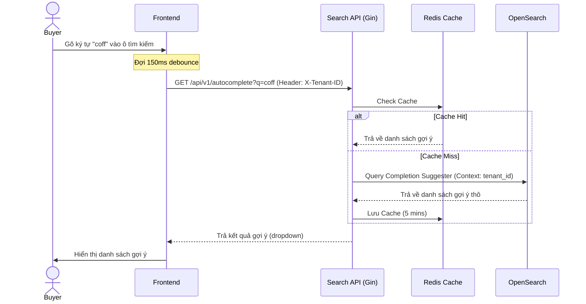

# US-003 - Autocomplete

Status: Draft
Priority: High
Related Requirements:
* FR-002 Autocomplete
* FR-009 Admin Management

---

# 1. Tiếng Việt

## Mục tiêu
Cung cấp gợi ý từ khóa tìm kiếm nhanh dưới 5ms khi người dùng đang nhập trên ô tìm kiếm. Các gợi ý phải được phân vùng chính xác theo từng Tenant (Marketplace) để tránh rò rỉ dữ liệu giữa các doanh nghiệp.

## User Story
Là một Buyer,  
Tôi muốn thấy các gợi ý từ khóa hiển thị ngay lập tức khi đang gõ từ khóa vào thanh tìm kiếm,  
Để tôi có thể nhanh chóng chọn được cụm từ tìm kiếm phù hợp mà không cần phải gõ toàn bộ.

## Actor
* Buyer

## Điều kiện tiên quyết
* Sản phẩm đã được index vào OpenSearch và các cụm từ gợi ý đã được đẩy vào trường `suggest`.
* Hệ thống Search API đang hoạt động bình thường.

## Luồng chính
1. Buyer gõ các ký tự đầu tiên của từ khóa (ví dụ: "coff") vào ô tìm kiếm.
2. Frontend (React) đợi 150ms (debounce) sau đó gửi request API `GET /api/v1/autocomplete?q=coff` kèm Header `X-Tenant-ID`.
3. Search API nhận request và chuẩn hóa ký tự đầu vào.
4. Search API kiểm tra Redis Cache cho gợi ý của tenant đó.
5. Nếu tồn tại trong Redis: Trả về kết quả ngay lập tức.
6. Nếu không tồn tại trong Redis:
   * Thực hiện truy vấn OpenSearch Completion Suggester trên trường `suggest`.
   * Lọc kết quả theo `tenant_context` bằng giá trị `X-Tenant-ID` lấy từ Header.
7. OpenSearch trả về danh sách các cụm từ khớp hậu tố/tiền tố.
8. Search API định dạng kết quả, lưu vào Redis Cache (TTL: 5 phút), và phản hồi cho Frontend.
9. Frontend hiển thị danh sách gợi ý dưới dạng dropdown dưới ô tìm kiếm.

## Sequence Diagram

## Tiêu chí chấp nhận (AC)
*   **AC-001**: Trả về tối đa 10 gợi ý từ khóa phù hợp nhất.
*   **AC-002**: Đảm bảo phân vùng Tenant. Kết quả gợi ý chỉ chứa các sản phẩm của tenant truyền trong Header `X-Tenant-ID`. Tuyệt đối không rò rỉ gợi ý từ tenant khác.
*   **AC-003**: Thời gian phản hồi API Autocomplete từ lúc nhận request đến lúc trả kết quả phải < 5ms (P95) ở điều kiện tải bình thường nhờ vào Redis Cache và Completion Suggester.
*   **AC-004**: Hỗ trợ độ chịu lỗi. Nếu OpenSearch lỗi, trả về danh sách rỗng (để không block ô gõ chữ của người dùng) thay vì trả về lỗi 500.
*   **AC-005**: Giao diện dropdown gợi ý phải hiển thị dạng danh sách hàng dọc thu nhỏ (vertical list), giới hạn chiều cao hiển thị tối đa khoảng 5 sản phẩm đầu tiên (chiều cao tối đa 300px), các kết quả còn lại hiển thị qua thanh cuộn (scroll) và không được chồng đè lên chân trang (Footer).

## Quy tắc nghiệp vụ (BR)
*   **BR-001**: Phải áp dụng kỹ thuật Debounce (150ms) ở Frontend để tránh spam request lên server khi người dùng gõ nhanh.
*   **BR-002**: Trường gợi ý phải bao gồm: Tên sản phẩm, Danh mục, và Thương hiệu.
*   **BR-003**: Phân biệt hoa thường: Không phân biệt chữ hoa, chữ thường khi thực hiện so khớp gợi ý.
*   **BR-004**: Tìm kiếm gợi ý có nhiều từ (multi-word suggest) phải khớp đồng thời tất cả các từ đơn (AND operator) trong chuỗi gợi ý để đảm bảo tính chính xác ngữ nghĩa và tránh hiển thị gợi ý lệch danh mục.
