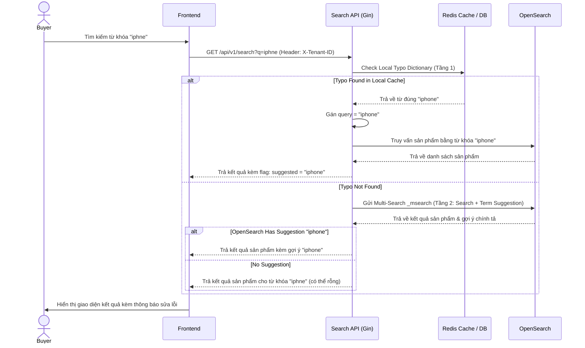

# US-004 - Spellcheck

Status: Implemented
Priority: Medium
Related Requirements:
* FR-003 Spellcheck
* FR-009 Admin Management

---

# 1. Tiếng Việt

## Mục tiêu
Tự động phát hiện và gợi ý/sửa lỗi chính tả từ khóa tìm kiếm (ví dụ: "iphne" thành "iphone") nhằm cải thiện trải nghiệm người dùng, tăng tỷ lệ tìm thấy sản phẩm và giảm thiểu các truy vấn trả về 0 kết quả.

## User Story
Là một Buyer,  
Tôi muốn công cụ tìm kiếm tự động nhận diện và sửa từ viết sai chính tả của tôi,  
Để tôi vẫn nhận được kết quả tìm kiếm chính xác mà không cần phải gõ lại.

## Actor
* Buyer

## Điều kiện tiên quyết
* Từ điển chính tả `spellcheck_dictionary` có dữ liệu (đã được Admin phê duyệt).
* OpenSearch lưu trữ tài liệu tìm kiếm và cấu hình suggester khả dụng.

## Luồng chính
1. Buyer nhập từ khóa viết sai chính tả (ví dụ: "iphne") và nhấn tìm kiếm.
2. Search API nhận từ khóa và chuẩn hóa (Normalize Query).
3. **Kiểm tra Tầng 1 (Local Cache)**: Search API tìm kiếm từ "iphne" trong bảng cache từ điển `spellcheck_dictionary` của tenant.
4. Nếu tìm thấy bản ghi phù hợp (ví dụ: `typo_word: iphne -> correct_word: iphone`):
   * Hệ thống tự động thay thế từ khóa tìm kiếm thành "iphone".
   * Gửi thông báo "Có phải bạn muốn tìm: **iphone**?" về cho Frontend.
   * Tiến hành luồng tìm kiếm bình thường với từ khóa "iphone".
5. Nếu không tìm thấy trong Local Cache:
   * **Kiểm tra Tầng 2 (OpenSearch Term Suggester)**: Gộp request tìm kiếm chính thức và request gợi ý từ viết sai chính tả vào làm một thông qua cơ chế **Multi-Search (`_msearch`)** của OpenSearch.
   * OpenSearch thực thi truy vấn tìm kiếm và đồng thời phân tích lỗi chính tả.
   * Nếu OpenSearch phát hiện từ viết sai và đưa ra gợi ý thay thế (ví dụ: "iphone"):
     * Trả về kết quả sản phẩm kèm theo chuỗi gợi ý sửa lỗi chính tả.
     * Frontend hiển thị dòng thông báo: *"Hiển thị kết quả cho **iphone**. Tìm kiếm thay thế cho **iphne**."*

## Sequence Diagram

## Tiêu chí chấp nhận (AC)
*   **AC-001**: Đối với các từ sai chính tả có trong từ điển phê duyệt của Admin, hệ thống phải tự động sửa lỗi và trả về kết quả sản phẩm của từ đúng mà không cần khách hàng bấm tìm lại.
*   **AC-002**: Đối với các từ sai chính tả được gợi ý từ OpenSearch, hệ thống phải trả về kết quả của từ sai (nếu có) kèm gợi ý từ đúng (Did you mean?).
*   **AC-003**: Sử dụng cơ chế Multi-Search để gộp chung yêu cầu Spellcheck và Search vào một request mạng duy nhất tới OpenSearch, đảm bảo latency tìm kiếm tổng thể không tăng quá 10ms.

## Quy tắc nghiệp vụ (BR)
*   **BR-001**: Từ điển sửa lỗi chính tả cục bộ phải được đồng bộ vào Redis Cache từ PostgreSQL của đúng tenant đó để tối ưu hóa hiệu năng tầng kiểm duyệt 1.
*   **BR-002**: Chỉ tự động sửa từ khóa nếu độ tin cậy của gợi ý (suggester confidence score) đạt trên ngưỡng quy định (ví dụ: `confidence > 0.8`).
