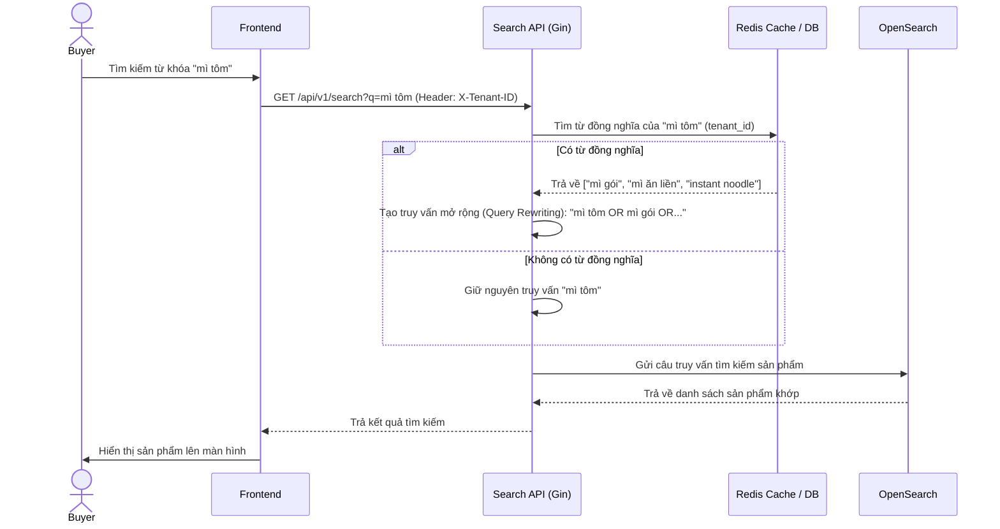

# US-005 - Synonym Expansion

Status: Draft
Priority: High
Related Requirements:
* FR-004 Synonym Expansion
* FR-009 Admin Management

---

# 1. Tiếng Việt

## Mục tiêu
Tự động mở rộng từ khóa tìm kiếm của người dùng bằng các từ đồng nghĩa tương ứng (ví dụ: "mì tôm" $\rightarrow$ "mì gói", "mì ăn liền") tại thời điểm tìm kiếm (Search-time) nhằm giảm tỷ lệ tìm kiếm không có kết quả và đảm bảo sản phẩm được hiển thị đầy đủ nhất.

## User Story
Là một Buyer,  
Tôi muốn tìm kiếm bằng bất kỳ từ đồng nghĩa nào của một sản phẩm,  
Để tôi vẫn tìm thấy sản phẩm đó ngay cả khi người bán sử dụng tên gọi khác.

## Actor
* Buyer

## Điều kiện tiên quyết
* Từ điển đồng nghĩa `synonyms` đã được Admin định nghĩa và lưu trong PostgreSQL/Redis.
* Search API đang hoạt động bình thường.

## Luồng chính
1. Buyer nhập từ khóa tìm kiếm (ví dụ: "mì tôm") và nhấn tìm kiếm.
2. Search API nhận request và chuẩn hóa từ khóa.
3. **Mở rộng tại Search-time**: Search API truy vấn từ khóa "mì tôm" trong cache từ điển đồng nghĩa (Redis) của tenant tương ứng (`X-Tenant-ID`).
4. Nếu tìm thấy các từ đồng nghĩa liên kết (ví dụ: "mì gói", "mì ăn liền", "instant noodle"):
   * Hệ thống tự động xây dựng lại câu truy vấn OpenSearch (Query Rewriting).
   * Thay vì chỉ tìm `product_name: "mì tôm"`, câu truy vấn sẽ được đổi thành dạng so khớp Boolean: 
     `(product_name_vi:"mì tôm" OR product_name_vi:"mì gói" OR product_name_vi:"mì ăn liền" OR product_name_en:"instant noodle")` với các mức trọng số khác nhau.
5. Search API gửi câu truy vấn đã mở rộng tới OpenSearch.
6. OpenSearch trả về danh sách sản phẩm khớp với bất kỳ từ nào trong tập hợp đồng nghĩa.
7. Trả kết quả tìm kiếm cho người dùng.

## Sequence Diagram

## Tiêu chí chấp nhận (AC)
*   **AC-001**: Khi người dùng tìm kiếm bằng một từ khóa, hệ thống phải tự động trả về cả các sản phẩm chứa từ đồng nghĩa của nó (ví dụ: tìm "cafe" trả về cả sản phẩm chứa chữ "cà phê").
*   **AC-002**: Khi Admin cập nhật hoặc phê duyệt một từ đồng nghĩa mới trong Admin Dashboard, thay đổi phải có hiệu lực ngay lập tức đối với các lượt tìm kiếm tiếp theo mà **không cần chạy lại tiến trình re-index sản phẩm**.
*   **AC-003**: Điểm số tương quan (ranking score) của kết quả khớp từ khóa gốc phải cao hơn kết quả khớp từ khóa đồng nghĩa (thực hiện bằng cách giảm trọng số boost của từ đồng nghĩa xuống khoảng `0.5` đến `0.7`).

## Quy tắc nghiệp vụ (BR)
* Tham chiếu các quy tắc từ [BR-301 đến BR-303](file:///Users/haopham/go-playground/search-engine/ba/brd/swiftsearch-search-engine-brd.md#c-synonym-expansion-m%E1%BB%9F-r%E1%BB%99ng-t%E1%BB%AB-%C4%91%E1%BB%93ng-ngh%C4%A9a) trong tài liệu BRD.

