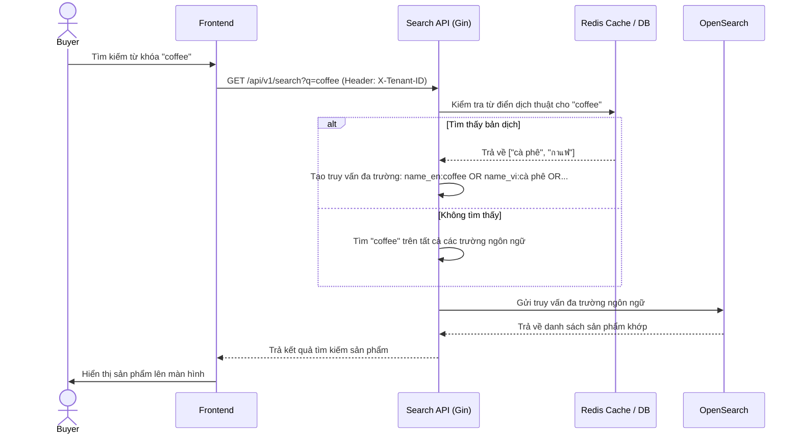

# US-006 - Multilingual Search

Status: Draft
Priority: High
Related Requirements:
* FR-005 Multilingual Search
* FR-009 Admin Management

---

# 1. Tiếng Việt

## Mục tiêu
Cho phép người mua tìm kiếm sản phẩm bằng bất kỳ ngôn ngữ nào được hỗ trợ (Tiếng Việt, Tiếng Anh, Tiếng Thái) và nhận kết quả chính xác, tận dụng thế mạnh phân tách từ vựng của từng ngôn ngữ trong OpenSearch.

## User Story
Là một Buyer,  
Tôi muốn tìm kiếm sản phẩm bằng ngôn ngữ ưa thích của mình (tiếng Việt, tiếng Anh hoặc tiếng Thái),  
Để tôi có thể dễ dàng tiếp cận các sản phẩm đa quốc gia mà không cần tự dịch từ khóa.

## Actor
* Buyer

## Điều kiện tiên quyết
* Sản phẩm đã được dịch thuật tự động và index vào các trường `product_name_vi`, `product_name_en`, `product_name_th` trong OpenSearch.
* OpenSearch được cấu hình bộ phân tích (Analyzers) tương ứng cho từng trường ngôn ngữ.

## Luồng chính
1. Buyer nhập từ khóa tìm kiếm (ví dụ bằng tiếng Anh: "coffee" hoặc tiếng Thái: "กาแฟ") trên ô tìm kiếm.
2. Search API nhận từ khóa và thực hiện chuẩn hóa (Normalize Query).
3. **Mở rộng Dịch thuật**: Search API tra cứu từ điển dịch thuật tĩnh (`translations`) trong Redis/PostgreSQL.
   * Nếu có từ điển khớp (ví dụ: "coffee" $\rightarrow$ dịch sang tiếng Việt: "cà phê", tiếng Thái: "กาแฟ"): Hệ thống bổ sung các từ khóa này vào tập hợp tìm kiếm.
4. **Truy vấn Đa Ngôn Ngữ**: Search API gửi truy vấn so khớp trên tất cả các trường ngôn ngữ tương ứng trong OpenSearch với trọng số tối ưu:
   * Nếu ngôn ngữ gốc của UI được cấu hình là Tiếng Việt:
     * `product_name_vi` (Trọng số chính: boost: 5)
     * `product_name_en` (Trọng số phụ: boost: 1.5)
     * `product_name_th` (Trọng số phụ: boost: 1.5)
5. OpenSearch áp dụng các bộ phân tích ngôn ngữ bản địa (`vietnamese`, `english`, `thai`) trên từng trường tương ứng:
   * Phân tách từ không khoảng trắng cho tiếng Thái.
   * Chuyển đổi số nhiều/số ít, động từ chia thì về từ gốc cho tiếng Anh.
6. Trả về kết quả khớp đa ngôn ngữ tốt nhất cho Buyer.

## Sequence Diagram

## Tiêu chí chấp nhận (AC)
*   **AC-001**: Khi người dùng gõ "coffee" (tiếng Anh) hoặc "กาแฟ" (tiếng Thái), hệ thống phải tìm thấy sản phẩm "Cà phê Robusta nguyên chất" (đã được dịch thuật tự động ở luồng ghi).
*   **AC-002**: Đảm bảo phân tách từ ngữ tiếng Thái hoạt động chính xác. Tìm kiếm từ khóa ghép tiếng Thái phải trả về sản phẩm khớp ngữ nghĩa nhờ bộ `thai` analyzer của OpenSearch.
*   **AC-003**: Hệ thống hỗ trợ mở rộng thêm ngôn ngữ mới (như tiếng Nhật, tiếng Trung) trong tương lai bằng cách định nghĩa thêm các trường `product_name_{lang}` mà không làm ảnh hưởng đến cấu trúc code hiện tại.

## Quy tắc nghiệp vụ (BR)
*   **BR-001**: Trọng số tìm kiếm ngôn ngữ hiện tại của người dùng (ngôn ngữ UI) phải luôn được thiết lập cao nhất (boost: 5) để ưu tiên kết quả khớp ngôn ngữ gốc.
*   **BR-002**: Việc dịch thuật từ khóa tìm kiếm (Search-time) chỉ sử dụng từ điển dịch thuật tĩnh (`translations` table) được Admin quản trị hoặc kết quả dịch cache, tuyệt đối **không gọi Google Translate API thời gian thực** trong luồng search của người dùng để tránh nghẽn mạng và tăng độ trễ.
