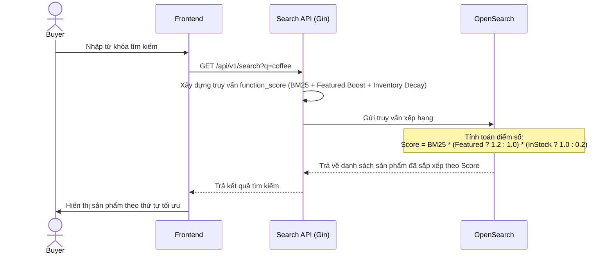

# US-007 - Ranking Engine

Status: Approved
Priority: High
Related Requirements:
* FR-006 Ranking Engine

---

# 1. Tiếng Việt

## Mục tiêu
Xếp hạng sản phẩm trả về từ truy vấn tìm kiếm một cách thông minh, đảm bảo các sản phẩm có độ tương quan văn bản tốt nhất, sản phẩm nổi bật (Featured), và sản phẩm còn hàng (In-stock) được xếp ở các vị trí đầu tiên.

## User Story
Là một Buyer,  
Tôi muốn thấy các sản phẩm phù hợp nhất, chất lượng tốt và còn hàng xuất hiện ở đầu trang kết quả,  
Để tôi có thể nhanh chóng đưa ra quyết định mua hàng mà không cần cuộn trang tìm kiếm quá nhiều.

## Actor
* Buyer

## Điều kiện tiên quyết
* Sản phẩm được lưu trữ trong OpenSearch có đầy đủ các trường dữ liệu: `featured (boolean)`, `inventory (int)`, `price (decimal)`, `category_name (text)`.
* Search API hoạt động bình thường.

## Luồng chính
1. Search API nhận từ khóa tìm kiếm và các bộ lọc từ Frontend.
2. Search API xây dựng câu truy vấn **`function_score`** gửi tới OpenSearch.
3. Cấu trúc tính điểm tương quan (Scoring Mechanism):
   * **Điểm Cơ Bản (Relevance Score - BM25)**: Tính toán điểm tương quan trên các trường văn bản theo trọng số:
     `Score_Base = (Name * 5) + (Category Name * 3) + (Description * 1)`
   * **Trọng số Nổi Bật (Featured Product Boost)**: Nếu sản phẩm được đánh dấu `"featured": true`, nhân thêm trọng số tăng điểm (ví dụ: nhân hệ số `1.2` hoặc cộng thêm điểm cố định `+10`).
   * **Trọng số Kho Hàng (Inventory Decay Boost)**: Áp dụng hàm suy hao đối với các sản phẩm hết hàng để đẩy chúng xuống cuối danh sách:
     * Nếu `inventory > 0`: Hệ số nhân là `1.0` (không giảm điểm).
     * Nếu `inventory == 0`: Hệ số nhân là `0.2` (giảm 80% điểm số tương quan).
4. OpenSearch thực thi tính toán điểm số cho các tài liệu phù hợp.
5. Sắp xếp danh sách kết quả theo điểm số giảm dần.
6. Trả về danh sách sản phẩm đã được xếp hạng cho người dùng.

## Sequence Diagram

## Tiêu chí chấp nhận (AC)
*   **AC-001**: Đối với cùng một từ khóa tìm kiếm, sản phẩm được đánh dấu `"featured": true` phải được ưu tiên đứng trước sản phẩm thông thường nếu độ tương quan văn bản tương đương nhau.
*   **AC-002**: Sản phẩm hết hàng (`inventory = 0`) không được phép đứng đầu trang kết quả tìm kiếm trừ khi không còn sản phẩm nào khác khớp với từ khóa. Sản phẩm hết hàng phải tự động bị đẩy xuống cuối danh sách kết quả.
*   **AC-003**: Đảm bảo hiệu năng tính toán. Toàn bộ logic tính điểm, nhân hệ số nổi bật và suy hao kho hàng phải được thực thi trực tiếp bằng engine tìm kiếm của OpenSearch thông qua câu lệnh `function_score` thay vì sắp xếp thủ công bằng Go trong bộ nhớ để đạt độ trễ < 50ms.

## Quy tắc nghiệp vụ (BR)
* Tham chiếu các quy tắc từ [BR-501 và BR-502](file:///Users/haopham/go-playground/search-engine/ba/brd/swiftsearch-search-engine-brd.md#e-ranking-engine-xếp-hạng-sản-phẩm) trong tài liệu BRD.

