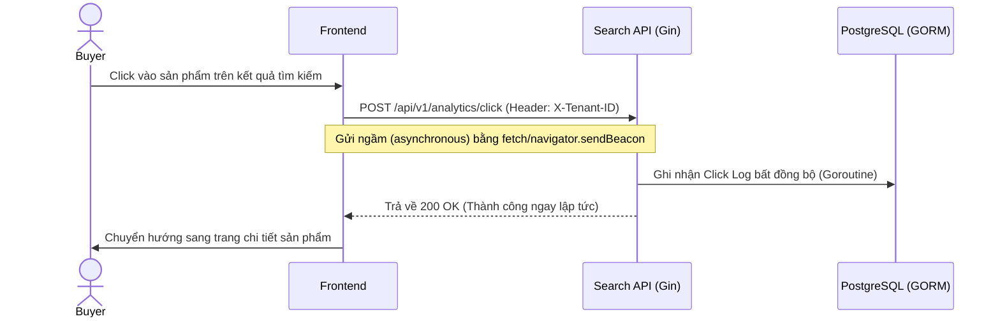

# US-008 - Click Tracking

Status: Draft
Priority: Medium
Related Requirements:
* FR-007 Search Analytics

---

# 1. Tiếng Việt

## Mục tiêu
Thu thập hành vi click vào sản phẩm của người dùng từ trang kết quả tìm kiếm và liên kết trực tiếp với phiên tìm kiếm ban đầu. Dữ liệu này là cơ sở để tính tỷ lệ Click-Through Rate (CTR) và làm đầu vào cho AI Suggestion Engine.

## User Story
Là một Product Manager,  
Tôi muốn ghi nhận chi tiết hành vi click sản phẩm của khách hàng tương ứng với từ khóa họ tìm kiếm,  
Để tôi có dữ liệu phân tích sản phẩm nào thực sự thu hút khách hàng và cải thiện giải thuật xếp hạng.

## Actor
* Buyer (Gây ra hành động click)
* Product API / Analytics System (Ghi nhận dữ liệu)

## Điều kiện tiên quyết
* Phiên tìm kiếm của người dùng đã được tạo và trả về mã định danh `search_log_id`.
* Cơ sở dữ liệu PostgreSQL khả dụng.

## Luồng chính
1. Buyer thực hiện tìm kiếm trên ứng dụng. API trả về danh sách sản phẩm kèm theo mã định danh `search_log_id` trong phần metadata của response.
2. Buyer click vào một sản phẩm trên trang kết quả.
3. Giao diện Frontend (React) phát một HTTP request ngầm (non-blocking) tới endpoint:
   `POST /api/v1/analytics/click`
   * **Header**: `X-Tenant-ID`
   * **Payload**:
     ```json
     {
       "search_log_id": "uuid-cua-phien-tim-kiem",
       "product_id": "uuid-cua-san-pham-duoc-click",
       "query": "coffee",
       "position": 3
     }
     ```
4. Search API nhận request, kiểm tra tính hợp lệ sơ bộ của dữ liệu.
5. Search API chuyển tiếp yêu cầu ghi nhận Click Log vào Goroutine ngầm để thực thi bất đồng bộ.
6. Search API lập tức phản hồi mã `200 OK` về cho Frontend (luồng xử lý mất dưới 2ms, không làm gián đoạn chuyển trang của người dùng).
7. Goroutine ngầm gọi Analytics Repository để thực hiện lưu trữ thông tin click vào bảng `click_logs` trong PostgreSQL bằng GORM.

## Sequence Diagram



## Tiêu chí chấp nhận (AC)
*   **AC-001**: API Click Tracking phải phản hồi nhanh dưới 5ms (P99) bằng cách đẩy yêu cầu ghi DB vào background goroutine bất đồng bộ.
*   **AC-002**: Bản ghi lưu trong bảng `click_logs` phải có giá trị khóa ngoại `search_log_id` khớp chính xác với bản ghi `search_logs` tương ứng để phục vụ phân tích.
*   **AC-003**: Nếu người dùng click cùng một sản phẩm nhiều lần trong cùng một phiên tìm kiếm, hệ thống vẫn ghi nhận đầy đủ các sự kiện click phục vụ thống kê tần suất.

## Quy tắc nghiệp vụ (BR)
*   **BR-001**: Để đảm bảo tính tin cậy khi người dùng chuyển trang nhanh, Frontend có thể sử dụng API `navigator.sendBeacon` hoặc cấu hình Fetch ở chế độ `keepalive: true`.
*   **BR-002**: Nếu `search_log_id` truyền lên không hợp lệ hoặc không đúng định dạng UUID, API vẫn trả về `200 OK` nhưng ghi log warning ở backend để tránh làm gián đoạn trải nghiệm của người dùng khi có lỗi track log.
