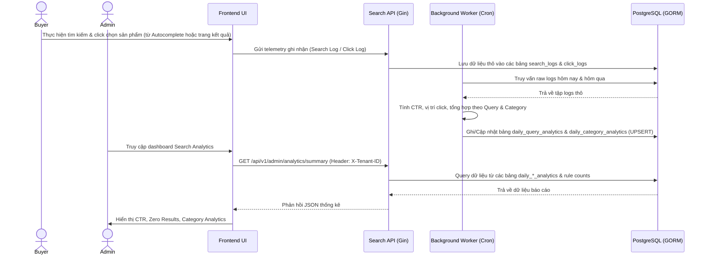

# US-009 - Search Analytics

Status: Implemented
Priority: Medium
Related Requirements:
* FR-007 Search Analytics
* FR-009 Admin Management

---

# 1. Tiếng Việt

## Mục tiêu
Cung cấp cho Admin các chỉ số thống kê và báo cáo về hoạt động tìm kiếm trên sàn thương mại điện tử nhằm phát hiện các xu hướng mua sắm mới, nhận diện các từ khóa lỗi và đo lường độ chính xác của giải thuật xếp hạng.

## User Story
Là một Marketplace Admin / Product Manager,  
Tôi muốn xem báo cáo thống kê về các từ khóa tìm kiếm phổ biến, các từ khóa bị lỗi không ra kết quả và tỷ lệ click chuột (CTR),  
Để tôi có thể tối ưu hóa danh mục sản phẩm và cải thiện chất lượng tìm kiếm.

## Actor
* Admin / Product Manager

## Điều kiện tiên quyết
* Hệ thống click_logs và search_logs đã tích lũy đủ dữ liệu hoạt động.
* Backend Service và cơ sở dữ liệu PostgreSQL khả dụng.

## Luồng chính

### A. Thu thập dữ liệu thô (Telemetry Collection)
Dữ liệu raw logs (`search_logs`, `click_logs`) làm cơ sở cho báo cáo phân tích được thu thập thông qua hai luồng tương tác chính của người dùng:
1. **Luồng 1 - Tìm kiếm qua Autocomplete rồi click sản phẩm**: Người dùng gõ từ khóa -> chọn trực tiếp sản phẩm từ danh sách gợi ý nhanh (autocomplete dropdown). Hệ thống tự sinh một Virtual Search Log và ghi nhận một Click Log tương ứng.
2. **Luồng 2 - Tìm kiếm thường rồi click sản phẩm trên trang kết quả**: Người dùng gõ từ khóa -> nhấn Enter/Tìm kiếm để đi tới trang kết quả tìm kiếm (ghi nhận Search Log kèm số lượng kết quả trả về) -> click chọn sản phẩm hiển thị trên trang kết quả (ghi nhận Click Log kèm vị trí hiển thị).

### B. Tính toán tổng hợp số liệu định kỳ (Background Job)
1. Một Background Cron Job chạy định kỳ hàng giờ (mặc định `0 * * * *`) trong `workerd` để tổng hợp dữ liệu tìm kiếm & click của ngày hôm nay và ngày hôm qua từ bảng raw logs (`search_logs`, `click_logs`) vào bảng tổng hợp (`daily_query_analytics`, `daily_category_analytics`).
2. Sử dụng câu lệnh UPSERT (`ON CONFLICT DO UPDATE`) để ghi đè/cập nhật lại số liệu nhằm đảm bảo tính chính xác và nhất quán.

### C. Truy cập & Xem báo cáo Admin Dashboard
1. Admin truy cập vào trang Admin Dashboard trên Admin UI.
2. Frontend gửi request lấy số liệu thống kê: `GET /api/v1/admin/analytics/summary?range={today|7days|30days}` (kèm Header `X-Tenant-ID`).
3. Search API nhận request và truy vấn dữ liệu báo cáo từ các bảng tổng hợp số liệu định kỳ:
   * **Summary Stats**: Tổng số lượt tìm kiếm, tổng số lượt tìm kiếm không ra kết quả (zero results), tỉ lệ Click-Through Rate (CTR) tổng thể, vị trí click trung bình (average position), số lượng quy tắc sửa lỗi từ điển (spellcheck rules), số lượng quy tắc từ đồng nghĩa (synonym rules).
   * **Top Zero Result Queries**: 10 từ khóa tìm kiếm nhiều nhất không có kết quả, đi kèm số lượt tìm để Admin làm cơ sở tối ưu hóa.
   * **Category Analytics**: Phân tích hoạt động tìm kiếm theo danh mục sản phẩm (số lượt tìm kiếm của danh mục, số lượt click, tỉ lệ CTR tương ứng).
4. Search API trả kết quả tổng hợp về cho Frontend.
5. Frontend hiển thị dữ liệu lên các bảng biểu trực quan dạng thẻ số liệu (cards) và bảng số liệu phân tích chi tiết.

## Sequence Diagram

## Tiêu chí chấp nhận (AC)
*   **AC-001**: Hiển thị chính xác tổng hợp CTR, trung bình vị trí click, số lượng rules sửa lỗi/đồng nghĩa và danh sách Top 10 từ khóa 0 kết quả (Zero Results) trong khoảng thời gian lựa chọn (`today`, `7days`, `30days`).
*   **AC-002**: Tốc độ phản hồi của API báo cáo dashboard phải dưới 200ms nhờ việc truy vấn trực tiếp từ các bảng pre-aggregated (`daily_query_analytics`, `daily_category_analytics`), không thực hiện `COUNT` hay `GROUP BY` trực tiếp trên bảng raw logs chứa hàng triệu dòng tại thời điểm xem.
*   **AC-003**: Số liệu báo cáo phải được lọc chính xác theo `tenant_id` lấy từ HTTP Header `X-Tenant-ID`.
*   **AC-004**: Ghi nhận đúng đắn dữ liệu search log và click log từ cả hai luồng tương tác (autocomplete click và search enter -> result click) để làm cơ sở tính toán CTR và vị trí click trung bình.

## Quy tắc nghiệp vụ (BR)
*   **BR-001**: Background Cron Job tổng hợp dữ liệu chạy hàng giờ để cập nhật số liệu CTR, Zero Result và phân bổ theo danh mục vào bảng tổng hợp.
*   **BR-002**: Background Cron Job dọn dẹp chạy lúc 2 AM hàng ngày để tự động xóa các dữ liệu raw logs (`search_logs`, `click_logs`) cũ hơn 90 ngày (Data Retention Policy) để tiết kiệm tài nguyên lưu trữ.
*   **BR-003**: Cung cấp API `POST /api/v1/admin/analytics/trigger?start_date=YYYY-MM-DD&end_date=YYYY-MM-DD` cho phép Admin chạy tổng hợp lại số liệu thủ công theo khoảng thời gian tùy chọn phục vụ việc sửa lỗi hoặc đồng bộ lại dữ liệu.

