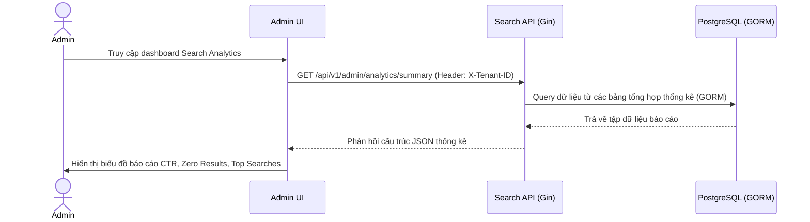

# US-009 - Search Analytics

Status: Draft
Priority: Medium
Related Requirements:
* FR-007 Search Analytics
* FR-009 Admin Management

---

# 1. Tiếng Việt

## Mục tiêu
Cung cấp cho Admin các chỉ số thống kê và báo cáo về hoạt động tìm kiếm trên sàn thương mại điện tử nhằm phát hiện các xu hướng mua sắm mới, nhận diện các từ khóa lỗi và đo lường độ chính xác của giải thuật xếp hạng.

## User Story
Là một Marketplace Admin / Product Manager,  
Tôi muốn xem báo cáo thống kê về các từ khóa tìm kiếm phổ biến, các từ khóa bị lỗi không ra kết quả và tỷ lệ click chuột (CTR),  
Để tôi có thể tối ưu hóa danh mục sản phẩm và cải thiện chất lượng tìm kiếm.

## Actor
* Admin / Product Manager

## Điều kiện tiên quyết
* Hệ thống click_logs và search_logs đã tích lũy đủ dữ liệu hoạt động.
* Backend Service và cơ sở dữ liệu PostgreSQL khả dụng.

## Luồng chính
1. Admin truy cập vào trang Admin Dashboard trên Admin UI.
2. Frontend gửi request lấy số liệu thống kê: `GET /api/v1/admin/analytics/summary` (kèm Header `X-Tenant-ID`).
3. Search API nhận request và truy vấn dữ liệu báo cáo.
4. Để đảm bảo hiệu năng truy vấn, hệ thống sử dụng các bảng tổng hợp số liệu định kỳ (được tính toán bằng Background Job chạy hàng giờ từ các bảng raw `search_logs` và `click_logs` bằng GORM):
   * **Top Search Queries**: 10 từ khóa được tìm kiếm nhiều nhất kèm số lượt click.
   * **Zero Result Searches**: Danh sách các từ khóa có lượt tìm kiếm cao nhưng kết quả trả về bằng 0 (Zero Result Rate).
   * **Click-Through Rate (CTR)**: Tỷ lệ nhấp chuột trung bình của từng từ khóa:
     $\text{CTR} = \frac{\text{Tổng số lượt click}}{\text{Tổng số lượt search}} \times 100\%$
   * **Average Position Clicked**: Vị trí nhấp chuột trung bình của sản phẩm trên trang kết quả để đánh giá độ chính xác của Ranking Engine.
5. Search API trả kết quả tổng hợp về cho Frontend.
6. Frontend render dữ liệu lên các bảng biểu trực quan dạng biểu đồ và bảng số liệu.

## Sequence Diagram

## Tiêu chí chấp nhận (AC)
*   **AC-001**: Hiển thị chính xác top 10 từ khóa tìm kiếm nhiều nhất và top 10 từ khóa có kết quả bằng 0 trong khoảng thời gian tùy chọn (Hôm nay, 7 ngày, 30 ngày qua).
*   **AC-002**: Tốc độ phản hồi của trang dashboard báo cáo phải dưới 200ms bằng cách sử dụng các bảng tổng hợp thống kê được tính toán trước (pre-aggregated tables), không được thực hiện các câu lệnh `COUNT` hoặc `GROUP BY` trực tiếp trên hàng triệu dòng raw logs tại thời điểm Admin xem báo cáo.
*   **AC-003**: Số liệu báo cáo phải được lọc chính xác theo `tenant_id` lấy từ HTTP Header để đảm bảo Admin của tenant nào chỉ thấy số liệu của tenant đó.

## Quy tắc nghiệp vụ (BR)
*   **BR-001**: Chạy một Background Cron Job định kỳ 1 tiếng 1 lần để quét các bảng `search_logs` và `click_logs` của các tenant, sau đó tính toán và cập nhật các chỉ số CTR, Zero Result vào bảng tổng hợp.
*   **BR-002**: Dữ liệu nhật ký thô (`search_logs`, `click_logs`) chỉ lưu trữ tối đa 90 ngày (Data Retention Policy) để giải phóng không gian ổ cứng PostgreSQL, các dữ liệu tổng hợp cũ hơn được lưu trữ lâu dài dưới dạng dữ liệu nén.
