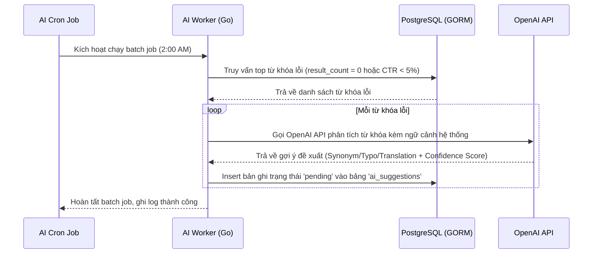

# US-010 - AI Suggestion Engine

Status: Draft
Priority: Medium
Related Requirements:
* FR-008 AI Suggestion Engine
* FR-009 Admin Management

---

# 1. Tiếng Việt

## Mục tiêu
Tự động phát hiện các từ khóa tìm kiếm bị lỗi hoặc không hiệu quả của người dùng, sử dụng Trí tuệ nhân tạo (OpenAI API) để phân tích ngoại tuyến và đề xuất các từ đồng nghĩa (synonyms), sửa lỗi chính tả (typos), hoặc dịch nghĩa (translations) mới, giúp hệ thống tự học và tối ưu theo thời gian.

## User Story
Là một Product Manager,  
Tôi muốn hệ thống tự động phân tích các từ khóa lỗi của khách hàng và đề xuất cách khắc phục bằng AI,  
Để tôi có thể liên tục cải tiến từ điển tìm kiếm mà không cần phân tích dữ liệu thủ công.

## Actor
* AI Worker (Hệ thống chạy tự động)
* OpenAI API (Dịch vụ trí tuệ nhân tạo)

## Điều kiện tiên quyết
* Nhật ký tìm kiếm `search_logs` và `click_logs` có dữ liệu hoạt động.
* OpenAI API Key cấu hình hợp lệ trong biến môi trường.
* Cơ sở dữ liệu PostgreSQL khả dụng.

## Luồng chính
1. Hệ thống kích hoạt AI Suggestion Cron Job định kỳ (ví dụ: hàng ngày vào lúc 2:00 AM).
2. AI Worker truy vấn PostgreSQL để lấy danh sách từ khóa gặp lỗi:
   * **Nhóm 1**: Top 50 từ khóa tìm kiếm có tần suất cao nhất nhưng trả về 0 kết quả (`result_count == 0`).
   * **Nhóm 2**: Top 50 từ khóa tìm kiếm có CTR cực thấp (dưới 5%) mặc dù có kết quả.
3. Với mỗi từ khóa lỗi, AI Worker tập hợp ngữ cảnh:
   * Từ khóa lỗi gốc.
   * Danh mục hàng đầu của hệ thống.
   * Danh sách tên các sản phẩm bán chạy gần nhất để làm gợi ý ngữ cảnh.
4. AI Worker gửi request tới OpenAI API (sử dụng OpenAI Structured Outputs để nhận về kết quả chuẩn hóa JSON).
5. OpenAI phân tích và trả về kết quả gợi ý:
   * Loại đề xuất: `synonym` (từ đồng nghĩa), `typo` (sửa chính tả) hoặc `translation` (bản dịch).
   * Từ gốc và từ đề xuất tương ứng.
   * Điểm tin cậy (Confidence score) từ 0.0 đến 1.0.
   * Lý do đề xuất.
6. AI Worker kiểm tra tính hợp lệ của dữ liệu phản hồi từ OpenAI.
7. AI Worker ghi nhận các đề xuất vào bảng `ai_suggestions` với trạng thái ban đầu là `pending`.

## Sequence Diagram

## Tiêu chí chấp nhận (AC)
*   **AC-001**: Hệ thống chỉ gửi tối đa 100 từ khóa lỗi nổi bật nhất sang OpenAI trong một lần chạy để tối ưu hóa chi phí API.
*   **AC-002**: Toàn bộ luồng phân tích và gọi OpenAI bắt buộc phải chạy ở tiến trình nền (background worker/cron job), tuyệt đối không ảnh hưởng đến bất kỳ API phục vụ trực tiếp nào.
*   **AC-003**: Dữ liệu lưu vào bảng `ai_suggestions` phải đầy đủ các trường: `suggestion_type`, `source_value`, `suggested_value`, `confidence_score` và `status = 'pending'`.

## Quy tắc nghiệp vụ (BR)
*   **BR-001**: Đặt giới hạn ngân sách (budget cap) và cảnh báo chi phí OpenAI hàng tháng trong file cấu hình để kiểm soát ngân sách chạy dự án.
*   **BR-002**: Không tạo đề xuất trùng lặp. Nếu một đề xuất (`source_value` + `suggested_value` + `suggestion_type`) đã tồn tại trong bảng `ai_suggestions` với trạng thái `pending` hoặc `approved`, hệ thống sẽ bỏ qua và không insert mới.
