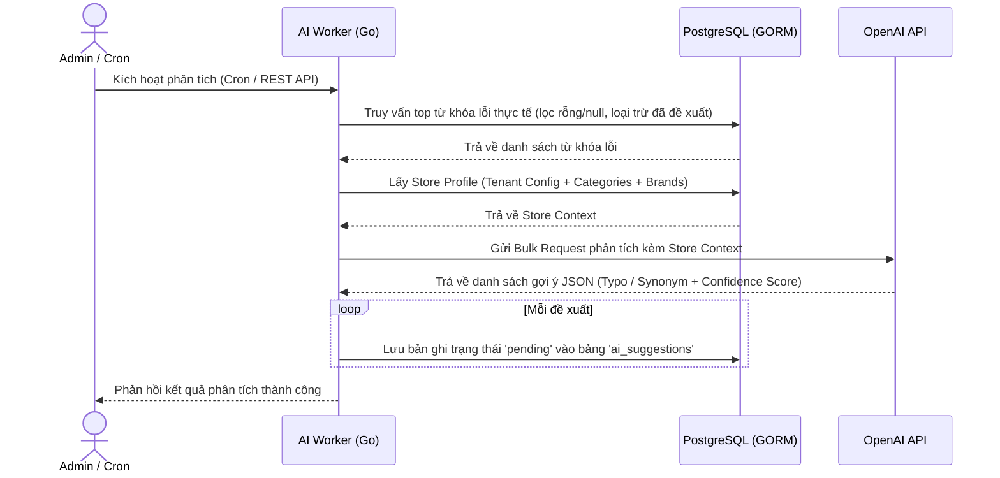

# US-010 - AI Suggestion Engine

Status: Implemented
Priority: Medium
Related Requirements:
* FR-008 AI Suggestion Engine
* FR-009 Admin Management

---

# 1. Tiếng Việt

## Mục tiêu
Tự động phát hiện các từ khóa tìm kiếm bị lỗi hoặc không hiệu quả của người dùng, sử dụng Trí tuệ nhân tạo (OpenAI API) để phân tích ngoại tuyến và đề xuất các từ đồng nghĩa (synonyms) hoặc sửa lỗi chính tả (typos) mới, giúp hệ thống tự học và tối ưu theo thời gian.

## User Story
Là một Product Manager,  
Tôi muốn hệ thống tự động phân tích các từ khóa lỗi của khách hàng và đề xuất cách khắc phục bằng AI,  
Để tôi có thể liên tục cải tiến từ điển tìm kiếm mà không cần phân tích dữ liệu thủ công.

## Actor
* AI Worker (Hệ thống chạy tự động)
* Marketplace Admin (Trigger thủ công từ giao diện)
* OpenAI API (Dịch vụ trí tuệ nhân tạo)

## Điều kiện tiên quyết
* Nhật ký tìm kiếm `search_logs` và `click_logs` có dữ liệu hoạt động.
* OpenAI API Key cấu hình hợp lệ trong biến môi trường.
* Cơ sở dữ liệu PostgreSQL khả dụng.

## Luồng chính
1. Luồng kích hoạt:
   * **Bất đồng bộ (Cron Job)**: Hệ thống tự động kích hoạt tiến trình nền định kỳ mỗi 10 phút.
   * **Đồng bộ thủ công (Admin API / UI)**: Admin click chọn nút "Phân tích AI ngay" trên giao diện Admin Dashboard để gửi request `POST /api/v1/admin/ai/suggestions/generate`.
2. AI Worker truy vấn PostgreSQL để lấy danh sách từ khóa gặp lỗi (và loại trừ các từ khóa trống/null):
   * **Nhóm 1 (Zero-results)**: Top 50 từ khóa tìm kiếm có tần suất cao nhất nhưng trả về 0 kết quả (`result_count == 0`), đồng thời không chứa từ khóa đã được phân tích trước đó trong bảng `ai_suggestions`.
   * **Nhóm 2 (Low-CTR)**: Top 50 từ khóa tìm kiếm có CTR cực thấp (dưới 5% trên tối thiểu 3 lượt tìm kiếm) mặc dù có kết quả, đồng thời không chứa từ khóa đã phân tích trước đó.
3. AI Worker tổng hợp ngữ cảnh động (Store Profile Context) cực kỳ gọn nhẹ để giảm thiểu Token:
   * Tên Tenant.
   * Mô tả kinh doanh (`business_domain` lấy từ bảng `tenant_configs`).
   * Danh sách tên Danh mục bán hàng (lấy từ bảng `categories`).
   * Danh sách các Thương hiệu nổi bật của Tenant (lấy từ bảng `products`).
4. AI Worker gom toàn bộ từ khóa lỗi và gửi một request duy nhất (Bulk Request) tới OpenAI API sử dụng OpenAI JSON Mode để tối ưu hóa chi phí mạng và token.
5. OpenAI phân tích dựa trên Guidelines và trả về kết quả gợi ý dạng cấu trúc JSON:
   * Loại đề xuất: `typo` (sửa lỗi gõ sai, thiếu dấu tiếng Việt) hoặc `synonym` (từ đồng nghĩa/tiếng Anh tương đương).
   * Từ gốc (`source_value`) và từ đề xuất tương ứng (`suggested_value`).
   * Điểm tin cậy (Confidence score) từ 0.0 đến 1.0.
   * Lý do đề xuất.
6. AI Worker kiểm tra tính hợp lệ của dữ liệu phản hồi từ OpenAI.
7. AI Worker ghi nhận các đề xuất vào bảng `ai_suggestions` với trạng thái ban đầu là `pending`.

## Sequence Diagram

## Tiêu chí chấp nhận (AC)
*   **AC-001**: Hệ thống chỉ gửi tối đa 100 từ khóa lỗi nổi bật nhất sang OpenAI trong một lần chạy để tối ưu hóa chi phí API.
*   **AC-002**: Toàn bộ luồng phân tích và gọi OpenAI được đóng gói bất đồng bộ trong background worker hoặc thông qua Admin API biệt lập, không ảnh hưởng đến bất kỳ API phục vụ trực tiếp nào.
*   **AC-003**: Dữ liệu lưu vào bảng `ai_suggestions` phải đầy đủ các trường: `suggestion_type`, `source_value`, `suggested_value`, `confidence_score` và `status = 'pending'`.

## Quy tắc nghiệp vụ (BR)
* Tham chiếu các quy tắc từ [BR-701 và BR-702](file:///Users/haopham/go-playground/search-engine/ba/brd/swiftsearch-search-engine-brd.md#g-ai-suggestion--admin-dictionary-management-qu%E1%BA%A3n-tr%E1%BB%8B-t%E1%BB%AB-%C4%91i%E1%BB%83n--%C4%91%E1%BB%81-xu%E1%BA%A5t-ai) trong tài liệu BRD.

