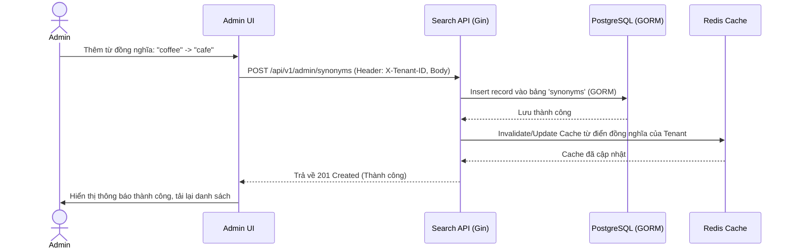

# US-011 - Synonym Management

Status: Draft
Priority: Medium
Related Requirements:
* FR-009 Admin Management
* FR-004 Synonym Expansion

---

# 1. Tiếng Việt

## Mục tiêu
Cung cấp giao diện quản trị Admin UI và các API tương ứng để quản lý từ điển đồng nghĩa (CRUD: Thêm, Đọc, Sửa, Xóa). Mọi thay đổi từ đồng nghĩa phải được áp dụng ngay lập tức vào công cụ tìm kiếm mà không cần khởi động lại dịch vụ hoặc re-index dữ liệu sản phẩm.

## User Story
Là một Marketplace Admin,  
Tôi muốn quản lý từ điển đồng nghĩa trên giao diện quản trị,  
Để tôi có thể chủ động định nghĩa các mối liên kết từ khóa mua sắm theo định hướng marketing hoặc xu hướng thị trường.

## Actor
* Admin

## Điều kiện tiên quyết
* Admin đã đăng nhập thành công vào hệ thống Admin Dashboard.
* Cơ sở dữ liệu PostgreSQL và Redis Cache khả dụng.

## Luồng chính
1. Admin điều hướng tới menu "Quản lý Từ đồng nghĩa" trên Admin UI.
2. Hệ thống tải danh sách các từ đồng nghĩa hiện tại:
   * Gửi request `GET /api/v1/admin/synonyms` (Header: `X-Tenant-ID`).
   * Trả về danh sách được lọc theo Tenant.
3. **Thêm từ đồng nghĩa mới**:
   * Admin nhập từ gốc (keyword) (ví dụ: "coffee") và từ đồng nghĩa (synonym) (ví dụ: "cà phê").
   * Hệ thống kiểm tra tính hợp lệ (không bỏ trống, không trùng lặp).
   * Gửi request `POST /api/v1/admin/synonyms`.
   * GORM lưu dữ liệu vào bảng `synonyms`.
   * **Cập nhật Cache**: Search API xóa/cập nhật cache từ điển đồng nghĩa tương ứng của tenant đó trong Redis.
4. **Sửa/Xóa từ đồng nghĩa**:
   * Admin cập nhật thông tin hoặc xóa từ khóa.
   * Hệ thống cập nhật bảng `synonyms` qua GORM và invalidate cache trong Redis.
5. Admin nhận thông báo cập nhật thành công.

## Sequence Diagram

## Tiêu chí chấp nhận (AC)
*   **AC-001**: Admin có thể xem, tìm kiếm, lọc danh sách từ đồng nghĩa theo từ khóa gốc hoặc từ đồng nghĩa của đúng tenant đang quản trị.
*   **AC-002**: Khi lưu thành công, từ khóa đồng nghĩa mới phải hoạt động ngay lập tức đối với luồng tìm kiếm của khách hàng mà không cần re-index lại sản phẩm (thông qua cơ chế Search-time Synonym và cập nhật cache Redis).
*   **AC-003**: Ngăn chặn trùng lặp hoàn toàn. Hệ thống không cho phép lưu hai bản ghi có cùng `keyword` + `synonym` trên cùng một tenant.

## Quy tắc nghiệp vụ (BR)
*   **BR-001**: Quyền truy cập: Chỉ các tài khoản có role `admin` hoặc `tenant_manager` mới được phép thao tác các API này. Các API bắt buộc phải validate quyền.
*   **BR-002**: Đồng bộ Cache: Ngay khi bảng `synonyms` thay đổi (Insert/Update/Delete), hệ thống bắt buộc phải invalidate khóa cache tương ứng trong Redis (ví dụ khóa: `synonyms:{tenant_id}`).
