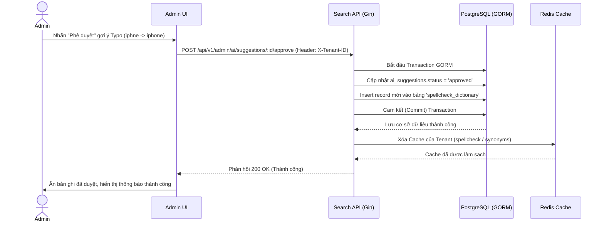

# US-012 - Approve AI Suggestion

Status: Implemented
Priority: Medium
Related Requirements:
* FR-008 AI Suggestion Engine
* FR-009 Admin Management

---

# 1. Tiếng Việt

## Mục tiêu
Cung cấp giao diện và các API để Admin xem xét, phê duyệt hoặc từ chối các đề xuất tối ưu hóa (từ đồng nghĩa, sửa lỗi chính tả) do AI tự động sinh ra. Đảm bảo dữ liệu được phê duyệt sẽ phân luồng ghi nhận vào đúng các bảng từ điển nghiệp vụ tương ứng và dọn dẹp Redis cache ngay lập tức.

## User Story
Là một Marketplace Admin,  
Tôi muốn duyệt qua danh sách các gợi ý sửa lỗi chính tả và từ đồng nghĩa do AI đề xuất,  
Để tôi có thể áp dụng các đề xuất chất lượng cao vào hệ thống tìm kiếm thực tế và loại bỏ các đề xuất không chính xác.

## Actor
* Admin

## Điều kiện tiên quyết
* Bảng `ai_suggestions` đã được AI Worker ghi nhận các bản ghi ở trạng thái `pending`.
* Admin đã đăng nhập thành công vào Admin Dashboard.

## Luồng chính
1. Admin truy cập vào màn hình "Phê duyệt gợi ý từ AI" trên Admin UI.
2. Hệ thống tải danh sách các đề xuất đang chờ: `GET /api/v1/admin/ai/suggestions?status=pending` (Header: `X-Tenant-ID`).
3. Admin xem xét từng đề xuất (gồm: Loại đề xuất, Từ gốc, Từ đề xuất, Điểm tin cậy, Lý do đề xuất).
4. **Phê duyệt đề xuất (Approve)**:
   * Admin bấm nút "Duyệt".
   * Gửi request `POST /api/v1/admin/ai/suggestions/:id/approve`.
   * Backend chuyển trạng thái bản ghi `ai_suggestions` từ `pending` sang `approved`.
   * **Phân luồng dữ liệu (Data Routing)**:
     * Nếu `suggestion_type == 'synonym'`: Hệ thống tự động insert một bản ghi mới vào bảng `search_synonyms` và xóa cache Redis `tenant:{tenantID}:synonyms:*`.
     * Nếu `suggestion_type == 'typo'`: Hệ thống tự động insert một bản ghi mới vào bảng `spellcheck_dictionary` và xóa cache Redis `tenant:{tenantID}:spellcheck:*`.
5. **Từ chối đề xuất (Reject)**:
   * Admin bấm nút "Từ chối".
   * Gửi request `POST /api/v1/admin/ai/suggestions/:id/reject`.
   * Backend chuyển trạng thái bản ghi sang `rejected`.
6. Admin UI tải lại danh sách đề xuất.

## Sequence Diagram

## Tiêu chí chấp nhận (AC)
*   **AC-001**: Admin có thể lọc danh sách gợi ý theo loại (`synonym`, `typo`) và sắp xếp theo điểm tin cậy (`confidence_score`) từ cao xuống thấp để ưu tiên duyệt trước.
*   **AC-002**: Khi phê duyệt một đề xuất, dữ liệu phải được ghi nhận đồng thời vào bảng đích (`search_synonyms` hoặc `spellcheck_dictionary`) thông qua một Database Transaction để đảm bảo tính toàn vẹn dữ liệu (không xảy ra lỗi cập nhật nửa chừng).
*   **AC-003**: Invalidate cache chính xác. Ngay sau khi duyệt đề xuất Synonym hoặc Typo, cache Redis tương ứng của tenant phải được xóa ngay lập tức để người mua được áp dụng quy tắc mới trong giây tiếp theo.

## Quy tắc nghiệp vụ (BR)
*   **BR-001**: Chỉ Admin mới có quyền thực hiện thao tác duyệt/từ chối gợi ý AI.
*   **BR-002**: Các bản ghi bị từ chối (`rejected`) vẫn giữ lại trong bảng `ai_suggestions` để AI Worker tránh quét và đề xuất lại cùng một từ khóa trong tương lai.
