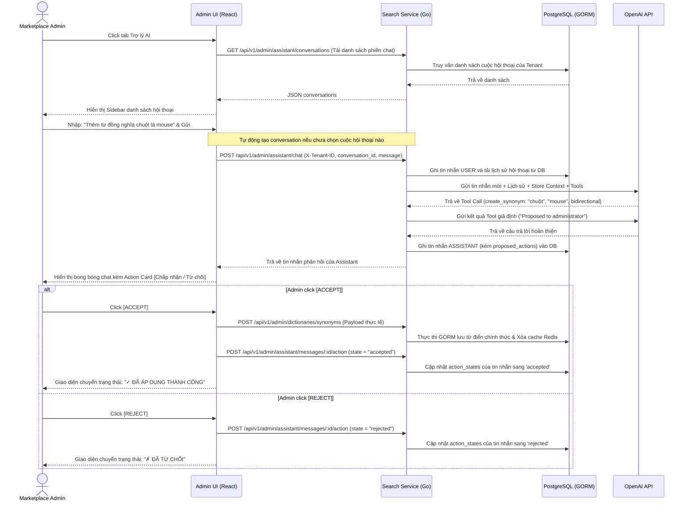

# US-013 - Admin AI Assistant

Status: Implemented
Priority: High
Related Requirements:
* FR-009 Admin Management
* FR-013 AI Conversational Assistant

---

# 1. Tiếng Việt

## Mục tiêu
Cung cấp một trợ lý AI thông minh (AI Assistant) trên giao diện quản trị (Admin Panel) sử dụng công nghệ OpenAI Tool/Function Calling. Trợ lý giúp Admin tra cứu thông tin sản phẩm và đề xuất các chỉnh sửa từ điển chính tả/đồng nghĩa bằng ngôn ngữ tự nhiên. 

Hệ thống hỗ trợ quản lý nhiều phiên hội thoại độc lập (multi-session/New Chat) lưu trữ trực tiếp dưới cơ sở dữ liệu PostgreSQL. Các đề xuất ghi/xóa từ điển của AI bắt buộc phải qua bước duyệt (Accept/Reject) của quản trị viên và trạng thái phê duyệt này được lưu trữ bền vững trong database.

## User Story
Là một Marketplace Admin,  
Tôi muốn trò chuyện trực tiếp với trợ lý AI trên Admin Dashboard thông qua các phiên hội thoại được lưu trữ,  
Để tôi có thể nhanh chóng tra cứu sản phẩm và lập các đề xuất thay đổi từ điển bằng câu lệnh ngôn ngữ tự nhiên một cách an toàn, có kiểm soát và đồng bộ trên mọi thiết bị.

## Actor
* Marketplace Admin
* Search API (Backend Go)
* PostgreSQL Database (Lưu trữ lịch sử hội thoại & trạng thái hành động)
* OpenAI API (Dịch vụ trí tuệ nhân tạo)

## Điều kiện tiên quyết
* Danh mục sản phẩm có dữ liệu hoạt động.
* Có các quy tắc Synonyms và Spellcheck được cấu hình (nếu muốn tra cứu).
* OpenAI API Key cấu hình hợp lệ trong biến môi trường.

## Luồng chính
1. Admin chọn tab **Trợ lý AI** trên giao diện Admin Panel.
2. Giao diện tải danh sách các cuộc hội thoại hiện tại từ `GET /api/v1/admin/assistant/conversations`.
3. Admin có thể click chọn một cuộc hội thoại cũ để tải tin nhắn từ `GET /api/v1/admin/assistant/conversations/:id/messages` hoặc click nút **[+ Hội thoại mới]** để bắt đầu một phiên chat mới.
4. Admin gửi câu hỏi hoặc yêu cầu cấu hình bằng ngôn ngữ tự nhiên (Ví dụ: *"Tôi muốn tạo từ đồng nghĩa cho bàn phím là phím cơ"*).
5. Giao diện gửi request `POST /api/v1/admin/assistant/chat` kèm theo `conversation_id` và tin nhắn mới nhất, cùng Headers cần thiết (`X-Tenant-ID`).
6. Backend Search Service nhận request:
   * Tải lịch sử tin nhắn của phiên hội thoại đó từ database.
   * Lưu tin nhắn của user vào database.
   * Thu thập ngữ cảnh hoạt động của Tenant (Tenant Name, categories, brands) và đính kèm vào System Prompt.
   * Định nghĩa danh sách các Tools gửi kèm request chat tới OpenAI API cùng với lịch sử tin nhắn.
7. OpenAI API phân tích câu hỏi:
   * **Trường hợp 1 (Tra cứu sản phẩm / từ điển)**: Gọi hàm truy xuất dữ liệu thực tế, backend Go thực thi GORM và gửi trả kết quả để OpenAI sinh câu trả lời tự nhiên.
   * **Trường hợp 2 (Yêu cầu Ghi/Xóa cấu hình)**: OpenAI kích hoạt các hàm đề xuất ghi/xóa. Backend nhận tham số, ghi nhận vào danh sách hành động đề xuất (`proposed_actions`) và trả về kết quả giả định cho OpenAI hoàn tất câu trả lời.
8. Backend lưu tin nhắn phản hồi của Assistant (kèm theo `proposed_actions` và trạng thái duyệt trống) vào DB, sau đó trả về cho Frontend.
9. Nếu đây là tin nhắn đầu tiên của cuộc trò chuyện, Backend tự động cập nhật tiêu đề cuộc trò chuyện bằng cách cắt ngắn nội dung tin nhắn đầu tiên.
10. Frontend hiển thị bong bóng chat kèm theo một **Action Card** hiển thị nội dung thay đổi và 2 nút: **[Chấp nhận / Accept]** và **[Từ chối / Reject]**. Trạng thái hiển thị của các nút này được lấy từ cơ sở dữ liệu (`action_states`).
11. Admin kiểm tra thông tin đề xuất:
    * **Nếu chọn [Chấp nhận / Accept]**: Frontend gọi API nghiệp vụ để lưu cấu hình thực tế, đồng thời gọi `POST /api/v1/admin/assistant/messages/:id/action` để lưu trạng thái `accepted` vào DB.
    * **Nếu chọn [Từ chối / Reject]**: Frontend gọi `POST /api/v1/admin/assistant/messages/:id/action` để lưu trạng thái `rejected` vào DB. Thẻ đề xuất chuyển sang trạng thái đã từ chối.

## Sequence Diagram

## Tiêu chí chấp nhận (AC)
*   **AC-001**: Trợ lý AI chỉ có quyền truy xuất và lập đề xuất dữ liệu trong phạm vi `tenant_id` được truyền trong header `X-Tenant-ID`.
*   **AC-002**: Tuyệt đối không cho phép AI Assistant tự động chỉnh sửa database hay cache mà không có tương tác click phê duyệt tường minh từ phía Admin (Human Gate).
*   **AC-003**: Hỗ trợ đầy đủ cổng phê duyệt cho: Thêm/Xóa từ đồng nghĩa, Thêm/Xóa luật chính tả.
*   **AC-004**: Trực quan hóa tiến trình gọi hàm: Giao diện React hiển thị rõ ràng AI đang chạy công cụ nào (ví dụ: *"Đang tra cứu sản phẩm..."*, *"Đang chuẩn bị đề xuất thêm..."*).
*   **AC-005**: Bảo mật: Tuyệt đối không cho phép AI Assistant thực thi các câu lệnh raw SQL, thay đổi cấu trúc DB, hoặc can thiệp dữ liệu của Tenant khác.
*   **AC-006**: Lịch sử hội thoại phải được lưu bền vững dưới PostgreSQL, tải đúng theo Tenant ID và có thể tạo mới/xóa bỏ phiên hội thoại.

## Quy tắc nghiệp vụ (BR)
*   **BR-001**: Thao tác click Accept từ UI sẽ kích hoạt các REST API nghiệp vụ chuẩn, qua đó đảm bảo tính năng đồng bộ cache Redis tự động hoạt động hoàn chỉnh.
*   **BR-002**: Lịch sử chat được lưu trữ bền vững tại PostgreSQL dưới schema `search_svc` với 2 bảng `assistant_conversations` và `assistant_messages`, hỗ trợ liên kết khóa ngoại cascade delete khi Admin xóa phiên trò chuyện.
