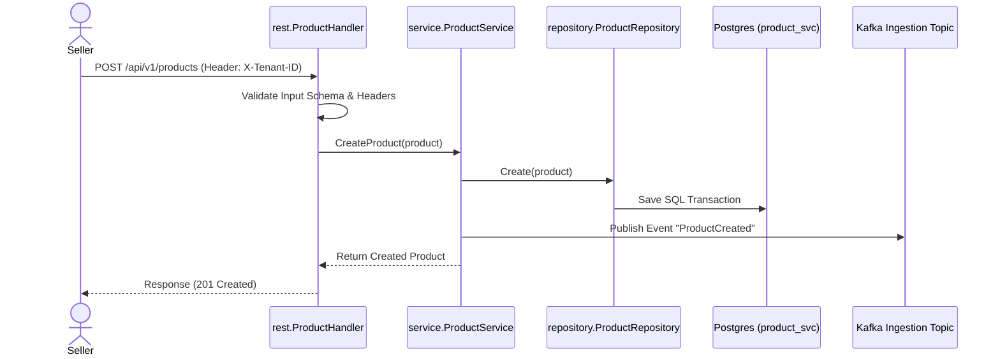

# Module Design - US-001 (Product Ingestion)

This document describes the design, database schemas, and workflows implemented in `product-service` to satisfy **US-001**.

---

## 1. Overview
Under US-001, `product-service` is established as the catalog Source of Truth. It processes product catalog listings from sellers and propagates mutations down-stream via a Kafka message broker.

---

## 2. Component Design & Directory Structure
```
product-service/
├── cmd/serverd/           # REST API Server entry point
├── internal/
│   ├── entity/            # Product domains (struct Product)
│   ├── handler/rest/v1/   # REST controller, validates headers/inputs
│   ├── service/           # Saves to DB and triggers Event Publisher
│   ├── repository/        # PostgreSQL queries using GORM
│   └── infrastructure/    # GORM and Kafka connections setup
```

---

## 3. Database Schema
Isolated inside the PostgreSQL schema `product_svc`.

### `product_svc.products`
Stores original product details.

| Column | Type | Constraints | Description |
| :--- | :--- | :--- | :--- |
| `id` | `uuid` | Primary Key | Product UUID |
| `tenant_id` | `varchar(255)` | Not Null, Index | Partition Key |
| `name` | `varchar(255)` | Not Null | Product name |
| `description` | `text` | | Product details |
| `category_id` | `uuid` | | Category ID |
| `brand` | `varchar(255)` | | Brand name |
| `price` | `numeric(15,2)` | Not Null, `>=0` | Unit price |
| `image_url` | `text` | | Image link |
| `inventory` | `integer` | Not Null, `>=0` | Stock amount |
| `original_language` | `varchar(10)` | Default: `'vi'` | Source language |
| `featured` | `boolean` | Default: `false` | Highlighted boost |
| `status` | `varchar(50)` | Default: `'active'` | `active`, `inactive` |
| `created_at`/`updated_at`| `timestamp` | | Timestamps |

---

## 4. Workflows


*Note: If GORM saving fails, Kafka publishing is bypassed, and an error is returned to guarantee transactional state integrity.*
