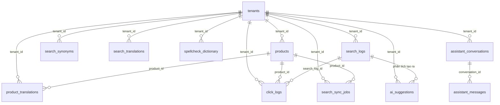

# Swift Search Engine - ERD (Entity Relationship Diagram)

## Mục tiêu

Thiết kế cấu trúc dữ liệu cơ sở dữ liệu quan hệ (PostgreSQL) hỗ trợ Product Catalog, Search Analytics, Query Expansion (Synonym/Translation/Spellcheck) và AI Suggestion Engine.

Hệ thống sử dụng cơ chế Multi-tenant chia sẻ cơ sở dữ liệu thông qua cột `tenant_id` phân vùng dữ liệu.

---

# Các bảng dữ liệu (Tables)

## 1. Schema: `product_svc`

### 1.1 tenants
Bảng lưu trữ thông tin các đối tác/marketplace độc lập.

| Column | Type | Constraints | Description |
| :--- | :--- | :--- | :--- |
| **id** | uuid | Primary Key | ID định danh duy nhất của tenant |
| **name** | varchar(255) | Not Null | Tên của tenant |
| **created_at**| timestamp | Not Null | Thời điểm tạo |
| **updated_at**| timestamp | Not Null | Thời điểm cập nhật |

---

### 1.2 products
Bảng lưu trữ thông tin sản phẩm gốc (Source of Truth).

| Column | Type | Constraints | Description |
| :--- | :--- | :--- | :--- |
| **id** | uuid | Primary Key | ID sản phẩm |
| **tenant_id** | uuid | Not Null, FK (tenants) | Thuộc về tenant nào |
| **name** | varchar(255) | Not Null | Tên sản phẩm gốc |
| **description**| text | Nullable | Mô tả sản phẩm gốc |
| **category_id**| uuid | Nullable, FK (categories)| Danh mục sản phẩm |
| **brand** | varchar(100) | Nullable | Thương hiệu |
| **price** | decimal(15,2) | Not Null, Default 0.00 | Giá bán sản phẩm |
| **image_url** | varchar(500) | Nullable | Link ảnh sản phẩm |
| **inventory** | integer | Not Null, Default 0 | Số lượng tồn kho |
| **status** | varchar(50) | Not Null, Default 'active' | Trạng thái (active, inactive, draft) |
| **featured** | boolean | Not Null, Default false | Sản phẩm nổi bật (dùng để boost điểm) |
| **original_language** | varchar(10) | Not Null, Default 'vi'| Ngôn ngữ gốc (vi, en, th) |
| **created_at**| timestamp | Not Null | Thời điểm tạo |
| **updated_at**| timestamp | Not Null | Thời điểm cập nhật |

---

### 1.3 product_translations
Bảng lưu trữ các bản dịch đa ngôn ngữ của tên và mô tả sản phẩm (dịch bởi Google Translate).

| Column | Type | Constraints | Description |
| :--- | :--- | :--- | :--- |
| **id** | uuid | Primary Key | ID bản dịch |
| **tenant_id** | uuid | Not Null, FK (tenants) | Thuộc về tenant nào |
| **product_id** | uuid | Not Null, FK (products) | Liên kết với sản phẩm gốc |
| **language_code** | varchar(10) | Not Null | Ngôn ngữ dịch (en, th, vi) |
| **name_translated** | varchar(255) | Not Null | Tên sản phẩm sau khi dịch |
| **description_translated** | text | Nullable | Mô tả sản phẩm sau khi dịch |
| **created_at**| timestamp | Not Null | Thời điểm tạo |
| **updated_at**| timestamp | Not Null | Thời điểm cập nhật |

---

## 2. Schema: `search_svc`

### 2.1 search_synonyms
Từ điển từ đồng nghĩa phục vụ mở rộng truy vấn tại Search-time.

| Column | Type | Constraints | Description |
| :--- | :--- | :--- | :--- |
| **id** | uuid | Primary Key | ID luật đồng nghĩa |
| **tenant_id** | uuid | Not Null, FK (tenants) | Thuộc về tenant nào |
| **keyword** | varchar(255) | Not Null | Từ khóa gốc (ví dụ: coffee) |
| **synonym** | varchar(255) | Not Null | Từ đồng nghĩa tương ứng (ví dụ: cafe) |
| **status** | varchar(50) | Not Null, Default 'active'| Trạng thái hoạt động |
| **created_at**| timestamp | Not Null | Thời điểm tạo |
| **updated_at**| timestamp | Not Null | Thời điểm cập nhật |

---

### 2.2 search_translations
Từ điển dịch thuật từ khóa tĩnh giúp gộp chung với synonym để expand truy vấn tại Search-time.

| Column | Type | Constraints | Description |
| :--- | :--- | :--- | :--- |
| **id** | uuid | Primary Key | ID luật dịch từ khóa |
| **tenant_id** | uuid | Not Null, FK (tenants) | Thuộc về tenant nào |
| **keyword** | varchar(255) | Not Null | Từ khóa gốc (ví dụ: coffee) |
| **lang_code** | varchar(10) | Not Null | Mã ngôn ngữ đích (vi, en, th) |
| **translation**| varchar(255) | Not Null | Giá trị dịch (ví dụ: cà phê) |
| **status** | varchar(50) | Not Null, Default 'active'| Trạng thái hoạt động |
| **created_at**| timestamp | Not Null | Thời điểm tạo |
| **updated_at**| timestamp | Not Null | Thời điểm cập nhật |

---

### 2.3 spellcheck_dictionary
Từ điển sửa lỗi chính tả thủ công hoặc sau khi được phê duyệt.

| Column | Type | Constraints | Description |
| :--- | :--- | :--- | :--- |
| **id** | uuid | Primary Key | ID luật spellcheck |
| **tenant_id** | uuid | Not Null, FK (tenants) | Thuộc về tenant nào |
| **typo_word** | varchar(255) | Not Null | Từ viết sai (ví dụ: iphne) |
| **correct_word**| varchar(255) | Not Null | Từ viết đúng (ví dụ: iphone) |
| **status** | varchar(50) | Not Null, Default 'active'| Trạng thái hoạt động |
| **created_at**| timestamp | Not Null | Thời điểm tạo |
| **updated_at**| timestamp | Not Null | Thời điểm cập nhật |

---

### 2.4 search_logs
Nhật ký tìm kiếm của khách hàng phục vụ thống kê phân tích và huấn luyện AI.

| Column | Type | Constraints | Description |
| :--- | :--- | :--- | :--- |
| **id** | uuid | Primary Key | ID log tìm kiếm |
| **tenant_id** | uuid | Not Null, FK (tenants) | Thuộc về tenant nào |
| **query** | varchar(255) | Not Null | Chuỗi tìm kiếm gốc |
| **normalized_query**| varchar(255) | Not Null | Chuỗi tìm kiếm đã normalize |
| **result_count**| integer | Not Null, Default 0 | Số lượng sản phẩm tìm thấy |
| **searched_at**| timestamp | Not Null | Thời điểm thực hiện tìm kiếm |

---

### 2.5 click_logs
Ghi nhận hành động click vào sản phẩm của Buyer trên trang Storefront.

| Column | Type | Constraints | Description |
| :--- | :--- | :--- | :--- |
| **id** | uuid | Primary Key | ID log click |
| **tenant_id** | uuid | Not Null, FK (tenants) | Thuộc về tenant nào |
| **search_log_id**| uuid | Not Null, FK (search_logs)| Liên kết với lượt tìm kiếm nào |
| **query** | varchar(255) | Not Null | Từ khóa tìm kiếm lúc click |
| **product_id** | uuid | Not Null, FK (products) | Sản phẩm được click |
| **position** | integer | Not Null, Default 1 | Vị trí hiển thị của sản phẩm lúc click |
| **clicked_at** | timestamp | Not Null | Thời điểm click |

---

### 2.6 ai_suggestions
Đề xuất từ đồng nghĩa hoặc sửa lỗi chính tả do AI sinh ra offline.

| Column | Type | Constraints | Description |
| :--- | :--- | :--- | :--- |
| **id** | uuid | Primary Key | ID đề xuất |
| **tenant_id** | uuid | Not Null, FK (tenants) | Thuộc về tenant nào |
| **suggestion_type**| varchar(100) | Not Null | Loại gợi ý (synonym, typo) |
| **source_value**| varchar(255) | Not Null | Từ khóa nguồn (ví dụ: iphne) |
| **suggested_value**| varchar(255) | Not Null | Giá trị đề xuất (ví dụ: iphone) |
| **confidence_score**| decimal(5,4) | Not Null, Default 0.0000| Độ tin cậy của AI |
| **status** | varchar(50) | Not Null, Default 'pending'| Trạng thái (pending, approved, rejected) |
| **created_at**| timestamp | Not Null | Thời điểm tạo |

---

### 2.7 search_sync_jobs
Lưu vết trạng thái đồng bộ dữ liệu sản phẩm từ Postgres sang OpenSearch.

| Column | Type | Constraints | Description |
| :--- | :--- | :--- | :--- |
| **id** | uuid | Primary Key | ID tiến trình |
| **tenant_id** | uuid | Not Null, FK (tenants) | Thuộc về tenant nào |
| **product_id** | uuid | Not Null, Unique Index | Liên kết sản phẩm cần đồng bộ |
| **status** | varchar(50) | Not Null, Default 'pending'| Trạng thái (pending, success, failed_...) |
| **error_message**| text | Nullable | Chi tiết lỗi nếu thất bại |
| **retry_count**| integer | Not Null, Default 0 | Số lần đã thử lại |
| **text_hash** | varchar(64) | Nullable | Mã băm SHA-256 (Name + Description) |
| **created_at**| timestamp | Not Null | Thời điểm tạo |
| **updated_at**| timestamp | Not Null | Thời điểm cập nhật |

---

### 2.8 assistant_conversations
Bảng lưu trữ thông tin các phiên hội thoại của Admin với Trợ lý AI.

| Column | Type | Constraints | Description |
| :--- | :--- | :--- | :--- |
| **id** | varchar(36) | Primary Key | ID định danh duy nhất của cuộc hội thoại (UUID) |
| **tenant_id** | varchar(100) | Not Null, Index | Thuộc về tenant nào |
| **title** | varchar(255) | Not Null | Tiêu đề cuộc hội thoại (tự động lấy từ tin nhắn đầu tiên) |
| **created_at**| timestamp | Not Null, Default CURRENT_TIMESTAMP | Thời điểm tạo |
| **updated_at**| timestamp | Not Null, Default CURRENT_TIMESTAMP | Thời điểm cập nhật |

---

### 2.9 assistant_messages
Bảng lưu trữ chi tiết các tin nhắn trong từng cuộc hội thoại, bao gồm cả các proposed actions do AI gợi ý và trạng thái phê duyệt.

| Column | Type | Constraints | Description |
| :--- | :--- | :--- | :--- |
| **id** | varchar(36) | Primary Key | ID định danh duy nhất của tin nhắn (UUID) |
| **conversation_id** | varchar(36) | Not Null, FK (assistant_conversations) ON DELETE CASCADE | Thuộc về cuộc hội thoại nào |
| **role** | varchar(50) | Not Null | Vai trò gửi tin nhắn (user, assistant, system) |
| **content** | text | Not Null | Nội dung tin nhắn văn bản |
| **proposed_actions** | text | Nullable | Chuỗi JSON chứa các đề xuất thay đổi từ điển (Synonym, Spellcheck) |
| **action_states** | text | Nullable | Chuỗi JSON lưu trữ trạng thái phê duyệt của từng đề xuất (accepted/rejected) |
| **created_at**| timestamp | Not Null, Default CURRENT_TIMESTAMP | Thời điểm tạo |

---

# Mối quan hệ giữa các bảng (Relations)

* Bảng `categories` có thể quan hệ 1:N với bảng `products` qua trường `category_id`.
* Bảng `search_logs` là nguồn đầu vào dữ liệu thô, được batch job offline phân tích và gọi OpenAI API để sinh ra các bản ghi tương ứng trong `ai_suggestions`.

